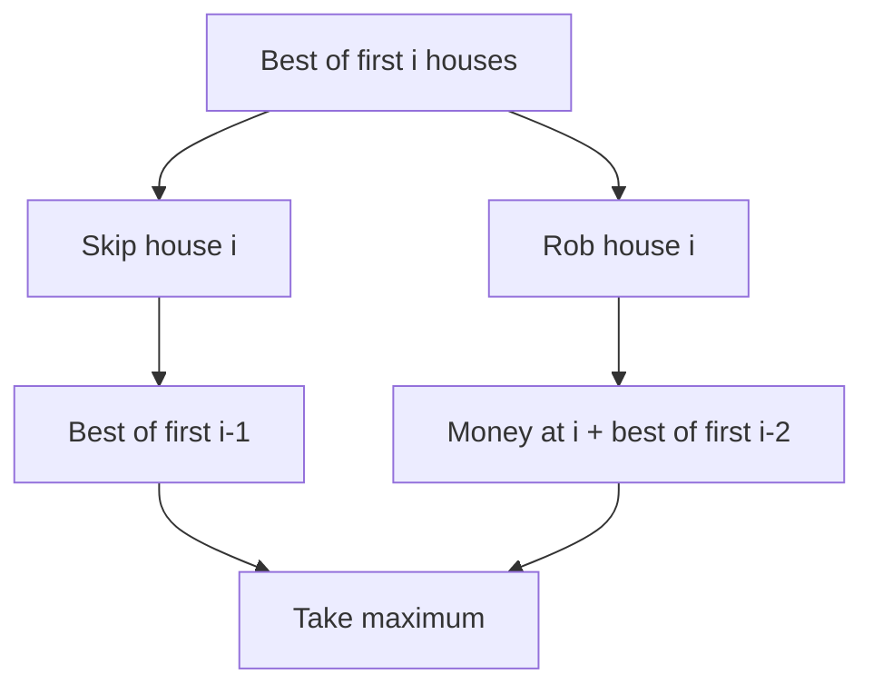
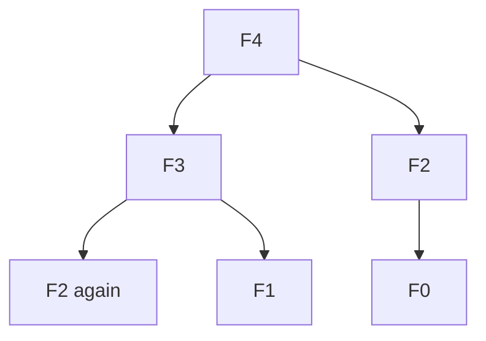

# 00 — Mathematical Foundations of Dynamic Programming

## 1. Start with a function, not a table

Mathematics begins by asking: **What is the answer to a smaller version of the same question?** Write a function `F(state)` that means exactly one thing. A state must contain everything needed to decide future actions; it must not contain irrelevant history.

Example: with houses `[2,7,9,3,1]`, define `F(i)` = maximum loot from the first `i` houses. Either skip the last house or rob it. These cases are exhaustive and mutually exclusive as decisions:

\[F(i)=\max(F(i-1),a_i+F(i-2)),\quad F(0)=0,\ F(1)=a_1.\]

The formula is **not guessed**: it follows by conditioning on the last decision. This is the same proof technique used in mathematical induction.

| i | House value | Skip | Take | F(i) |
|---|---:|---:|---:|---:|
| 1 | 2 | 0 | 2 | 2 |
| 2 | 7 | 2 | 7 | 7 |
| 3 | 9 | 7 | 11 | 11 |
| 4 | 3 | 11 | 10 | 11 |
| 5 | 1 | 11 | 12 | 12 |

## 2. The five common algebraic operations

- **Maximum:** `max` over possible decisions (highest reward).
- **Minimum:** `min` over possible decisions (lowest cost).
- **Sum:** `+` over disjoint choices (number of ways).
- **Boolean OR:** whether *any* choice is feasible.
- **Expectation:** weighted sum `Σ probability × future value`.

These are different aggregations of the same principle: decompose into smaller states.

## 3. Optimal substructure: why the recurrence is correct

If the best solution chooses action A, the remaining solution must itself be best for the resulting subproblem. Otherwise replacing it with a better subsolution improves the whole answer, a contradiction. **Caution:** this property only holds if the state captures all constraints and interactions.

## 4. Overlapping subproblems and memoization

Naive recursion revisits the same state. A cache keyed by the full state computes it once. Tabulation computes states in a valid dependency order. Space optimization discards states only after proving no future transition needs them.

## 5. Counting is not optimization

In Unique Paths, disjoint ways from top and left are **added**: `ways(i,j)=ways(i-1,j)+ways(i,j-1)`. In Minimum Path Sum, you **choose** the cheaper predecessor: `cost(i,j)=grid(i,j)+min(cost(i-1,j),cost(i,j-1))`. Same graph, different mathematics.

## 6. Complexity from state-space size

Time = number of reachable states × transitions evaluated per state, plus data-structure overhead. Space = states stored (and recursion stack if applicable). Example: a `m × n` grid with 16 XOR values has `16mn` states; transitions are constant per state.

## 7. Boundary values and invalid states

- Counting: impossible = `0`, empty valid construction often = `1`.
- Maximize: impossible = negative infinity; neutral feasible value often `0`.
- Minimize: impossible = positive infinity; completed goal = `0`.
- Boolean: impossible = `false`; completed valid goal = `true`.

Incorrect base cases are among the most common DP bugs.

## 8. Mathematical proof checklist

1. Define the state and its invariant.
2. Show the choices cover every valid solution.
3. Show choices do not count the same solution twice (when counting).
4. Show each transition moves to a smaller / acyclic state.
5. Prove base cases.
6. Use induction on the dependency order to prove the recurrence.
