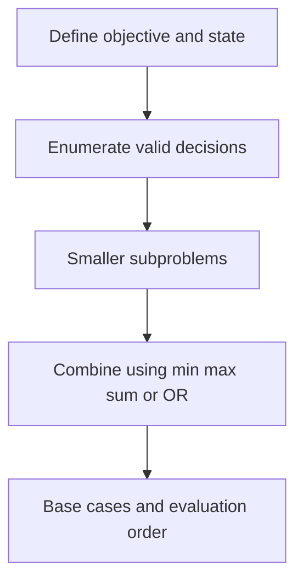

# Chapter 03 — Grid Paths and Geometric DP

## Core mathematical idea

A cell or position is a state; transitions come from legal predecessor positions..

## A representative mathematical model

`F(i,j)=F(i-1,j)+F(i,j-1)`

For minimum cost paths, replace + of paths with min of predecessor costs, then add the current cell cost. Obstacles contribute zero ways.

**Important:** This formula is a pattern template. The precise recurrence for a listed problem must be derived from that problem’s constraints and code.

## State-transition picture

## How to study the linked problems

For each problem: read the mathematical template, articulate its state and decision, inspect the submitted implementation, then justify why its transitions are correct. Compare with the previous problem: which constraint forced a new state dimension?

## Problems in this family (30)

- [63. Unique Paths II](Problems/63.md) — Medium
- [64. Minimum Path Sum](Problems/64.md) — Medium
- [120. Triangle](Problems/120.md) — Medium
- [174. Dungeon Game](Problems/174.md) — Hard
- [221. Maximal Square](Problems/221.md) — Medium
- [403. Frog Jump](Problems/403.md) — Hard
- [514. Freedom Trail](Problems/514.md) — Hard
- [576. Out of Boundary Paths](Problems/576.md) — Medium
- [741. Cherry Pickup](Problems/741.md) — Hard
- [764. Largest Plus Sign](Problems/764.md) — Medium
- [931. Minimum Falling Path Sum](Problems/931.md) — Medium
- [935. Knight Dialer](Problems/935.md) — Medium
- [1139. Largest 1-Bordered Square](Problems/1139.md) — Medium
- [1269. Number of Ways to Stay in the Same Place After Some Steps](Problems/1269.md) — Hard
- [1277. Count Square Submatrices with All Ones](Problems/1277.md) — Medium
- [1289. Minimum Falling Path Sum II](Problems/1289.md) — Hard
- [1301. Number of Paths with Max Score](Problems/1301.md) — Hard
- [1444. Number of Ways of Cutting a Pizza](Problems/1444.md) — Hard
- [1463. Cherry Pickup II](Problems/1463.md) — Hard
- [1473. Paint House III](Problems/1473.md) — Hard
- [1594. Maximum Non Negative Product in a Matrix](Problems/1594.md) — Medium
- [1659. Maximize Grid Happiness](Problems/1659.md) — Hard
- [1824. Minimum Sideway Jumps](Problems/1824.md) — Medium
- [1931. Painting a Grid With Three Different Colors](Problems/1931.md) — Hard
- [1937. Maximum Number of Points with Cost](Problems/1937.md) — Medium
- [3393. Count Paths With the Given XOR Value](Problems/3393.md) — Medium
- [3418. Maximum Amount of Money Robot Can Earn](Problems/3418.md) — Medium
- [3429. Paint House IV](Problems/3429.md) — Medium
- [3459. Length of Longest V-Shaped Diagonal Segment](Problems/3459.md) — Hard
- [4016. Maximum Area of Two Non-Overlapping Square Submatrices](Problems/4016.md) — Medium
