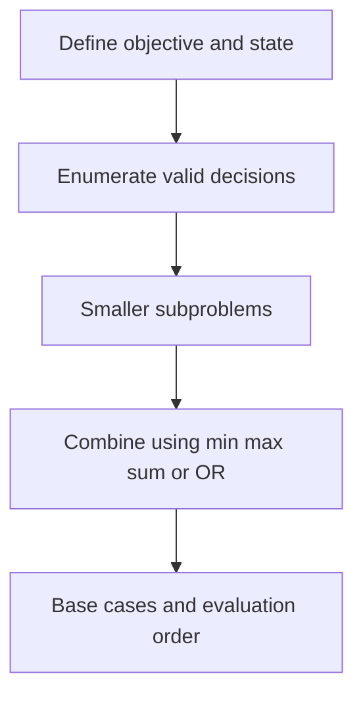

# Chapter 05 — Subsequence and Ordering DP

## Core mathematical idea

A subsequence is built by choosing a compatible predecessor..

## A representative mathematical model

`L(i)=1+\max_{j<i,\;a_j<a_i}L(j)`

When there is no predecessor, length is one. More advanced variants add dimensions such as last difference or number of chosen elements.

**Important:** This formula is a pattern template. The precise recurrence for a listed problem must be derived from that problem’s constraints and code.

## State-transition picture

## How to study the linked problems

For each problem: read the mathematical template, articulate its state and decision, inspect the submitted implementation, then justify why its transitions are correct. Compare with the previous problem: which constraint forced a new state dimension?

## Problems in this family (23)

- [300. Longest Increasing Subsequence](Problems/300.md) — Medium
- [354. Russian Doll Envelopes](Problems/354.md) — Hard
- [368. Largest Divisible Subset](Problems/368.md) — Medium
- [376. Wiggle Subsequence](Problems/376.md) — Medium
- [392. Is Subsequence](Problems/392.md) — Easy
- [413. Arithmetic Slices](Problems/413.md) — Medium
- [446. Arithmetic Slices II - Subsequence](Problems/446.md) — Hard
- [467. Unique Substrings in Wraparound String](Problems/467.md) — Medium
- [646. Maximum Length of Pair Chain](Problems/646.md) — Medium
- [673. Number of Longest Increasing Subsequence](Problems/673.md) — Medium
- [792. Number of Matching Subsequences](Problems/792.md) — Medium
- [960. Delete Columns to Make Sorted III](Problems/960.md) — Hard
- [978. Longest Turbulent Subarray](Problems/978.md) — Medium
- [1027. Longest Arithmetic Subsequence](Problems/1027.md) — Medium
- [1048. Longest String Chain](Problems/1048.md) — Medium
- [1218. Longest Arithmetic Subsequence of Given Difference](Problems/1218.md) — Medium
- [1395. Count Number of Teams](Problems/1395.md) — Medium
- [1402. Reducing Dishes](Problems/1402.md) — Hard
- [1626. Best Team With No Conflicts](Problems/1626.md) — Medium
- [1691. Maximum Height by Stacking Cuboids](Problems/1691.md) — Hard
- [1770. Maximum Score from Performing Multiplication Operations](Problems/1770.md) — Hard
- [1911. Maximum Alternating Subsequence Sum](Problems/1911.md) — Medium
- [3409. Longest Subsequence With Decreasing Adjacent Difference](Problems/3409.md) — Medium
