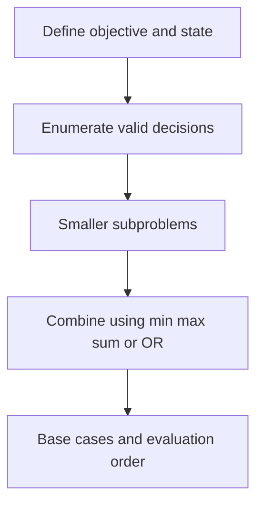

# Chapter 10 — Tree, Graph and DAG DP

## Core mathematical idea

Count or optimize subject to a bound, random transition, or digit restriction..

## A representative mathematical model

`F(state)=\sum_{choice}P(choice)F(next(state,choice))`

For probability, multiply by transition probabilities. For digit DP, track position, tightness and relevant history.

**Important:** This formula is a pattern template. The precise recurrence for a listed problem must be derived from that problem’s constraints and code.

## State-transition picture

## How to study the linked problems

For each problem: read the mathematical template, articulate its state and decision, inspect the submitted implementation, then justify why its transitions are correct. Compare with the previous problem: which constraint forced a new state dimension?

## Problems in this family (20)

- [124. Binary Tree Maximum Path Sum](Problems/124.md) — Hard
- [329. Longest Increasing Path in a Matrix](Problems/329.md) — Hard
- [458. Poor Pigs](Problems/458.md) — Hard
- [542. 01 Matrix](Problems/542.md) — Medium
- [787. Cheapest Flights Within K Stops](Problems/787.md) — Medium
- [834. Sum of Distances in Tree](Problems/834.md) — Hard
- [968. Binary Tree Cameras](Problems/968.md) — Hard
- [1162. As Far from Land as Possible](Problems/1162.md) — Medium
- [1334. Find the City With the Smallest Number of Neighbors at a Threshold Distance](Problems/1334.md) — Medium
- [1372. Longest ZigZag Path in a Binary Tree](Problems/1372.md) — Medium
- [1373. Maximum Sum BST in Binary Tree](Problems/1373.md) — Hard
- [1483. Kth Ancestor of a Tree Node](Problems/1483.md) — Hard
- [1617. Count Subtrees With Max Distance Between Cities](Problems/1617.md) — Hard
- [1786. Number of Restricted Paths From First to Last Node](Problems/1786.md) — Medium
- [1857. Largest Color Value in a Directed Graph](Problems/1857.md) — Hard
- [1916. Count Ways to Build Rooms in an Ant Colony](Problems/1916.md) — Hard
- [1928. Minimum Cost to Reach Destination in Time](Problems/1928.md) — Hard
- [1976. Number of Ways to Arrive at Destination](Problems/1976.md) — Medium
- [2003. Smallest Missing Genetic Value in Each Subtree](Problems/2003.md) — Hard
- [2127. Maximum Employees to Be Invited to a Meeting](Problems/2127.md) — Hard
