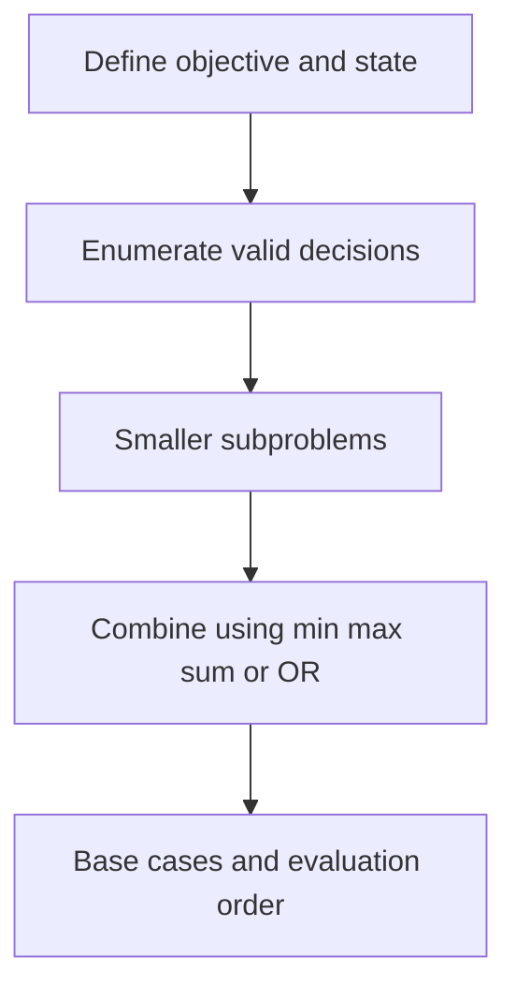

# Chapter 11 — Digit DP, Counting and Probability

## Core mathematical idea

Use algebraic invariants, prefix summaries, or monotonic structures instead of a full DP table..

## A representative mathematical model

`bestEnding(i)=\max(a_i,a_i+bestEnding(i-1))`

This is Kadane’s recurrence; other problems in this group may use greedy, stacks, two pointers, prefix sums, or a specialized optimization—not necessarily DP.

**Important:** This formula is a pattern template. The precise recurrence for a listed problem must be derived from that problem’s constraints and code.

## State-transition picture

## How to study the linked problems

For each problem: read the mathematical template, articulate its state and decision, inspect the submitted implementation, then justify why its transitions are correct. Compare with the previous problem: which constraint forced a new state dimension?

## Problems in this family (56)

- [5. Longest Palindromic Substring](Problems/5.md) — Medium
- [22. Generate Parentheses](Problems/22.md) — Medium
- [32. Longest Valid Parentheses](Problems/32.md) — Hard
- [42. Trapping Rain Water](Problems/42.md) — Hard
- [45. Jump Game II](Problems/45.md) — Medium
- [53. Maximum Subarray](Problems/53.md) — Medium
- [55. Jump Game](Problems/55.md) — Medium
- [85. Maximal Rectangle](Problems/85.md) — Hard
- [122. Best Time to Buy and Sell Stock II](Problems/122.md) — Medium
- [152. Maximum Product Subarray](Problems/152.md) — Medium
- [233. Number of Digit One](Problems/233.md) — Hard
- [357. Count Numbers with Unique Digits](Problems/357.md) — Medium
- [396. Rotate Function](Problems/396.md) — Medium
- [435. Non-overlapping Intervals](Problems/435.md) — Medium
- [600. Non-negative Integers without Consecutive Ones](Problems/600.md) — Hard
- [629. K Inverse Pairs Array](Problems/629.md) — Hard
- [688. Knight Probability in Chessboard](Problems/688.md) — Medium
- [788. Rotated Digits](Problems/788.md) — Medium
- [799. Champagne Tower](Problems/799.md) — Medium
- [808. Soup Servings](Problems/808.md) — Medium
- [828. Count Unique Characters of All Substrings of a Given String](Problems/828.md) — Hard
- [837. New 21 Game](Problems/837.md) — Medium
- [838. Push Dominoes](Problems/838.md) — Medium
- [898. Bitwise ORs of Subarrays](Problems/898.md) — Medium
- [902. Numbers At Most N Given Digit Set](Problems/902.md) — Hard
- [903. Valid Permutations for DI Sequence](Problems/903.md) — Hard
- [907. Sum of Subarray Minimums](Problems/907.md) — Medium
- [1012. Numbers With Repeated Digits](Problems/1012.md) — Hard
- [1014. Best Sightseeing Pair](Problems/1014.md) — Medium
- [1024. Video Stitching](Problems/1024.md) — Medium
- [1186. Maximum Subarray Sum with One Deletion](Problems/1186.md) — Medium
- [1191. K-Concatenation Maximum Sum](Problems/1191.md) — Medium
- [1326. Minimum Number of Taps to Open to Water a Garden](Problems/1326.md) — Hard
- [1397. Find All Good Strings](Problems/1397.md) — Hard
- [1425. Constrained Subsequence Sum](Problems/1425.md) — Hard
- [1467. Probability of a Two Boxes Having The Same Number of Distinct Balls](Problems/1467.md) — Hard
- [1493. Longest Subarray of 1's After Deleting One Element](Problems/1493.md) — Medium
- [1504. Count Submatrices With All Ones](Problems/1504.md) — Medium
- [1524. Number of Sub-arrays With Odd Sum](Problems/1524.md) — Medium
- [1525. Number of Good Ways to Split a String](Problems/1525.md) — Medium
- [1526. Minimum Number of Increments on Subarrays to Form a Target Array](Problems/1526.md) — Hard
- [1537. Get the Maximum Score](Problems/1537.md) — Hard
- [1567. Maximum Length of Subarray With Positive Product](Problems/1567.md) — Medium
- [1578. Minimum Time to Make Rope Colorful](Problems/1578.md) — Medium
- [1696. Jump Game VI](Problems/1696.md) — Medium
- [1871. Jump Game VII](Problems/1871.md) — Medium
- [1888. Minimum Number of Flips to Make the Binary String Alternating](Problems/1888.md) — Medium
- [2063. Vowels of All Substrings](Problems/2063.md) — Medium
- [2100. Find Good Days to Rob the Bank](Problems/2100.md) — Medium
- [2110. Number of Smooth Descent Periods of a Stock](Problems/2110.md) — Medium
- [3410. Maximize Subarray Sum After Removing All Occurrences of One Element](Problems/3410.md) — Hard
- [3428. Maximum and Minimum Sums of at Most Size K Subsequences](Problems/3428.md) — Medium
- [3448. Count Substrings Divisible By Last Digit](Problems/3448.md) — Hard
- [3458. Select K Disjoint Special Substrings](Problems/3458.md) — Medium
- [3989. Maximum Consistent Columns in a Grid](Problems/3989.md) — Hard
- [4058. Maximum Pulse Value After One Subarray Rotation](Problems/4058.md) — Medium
