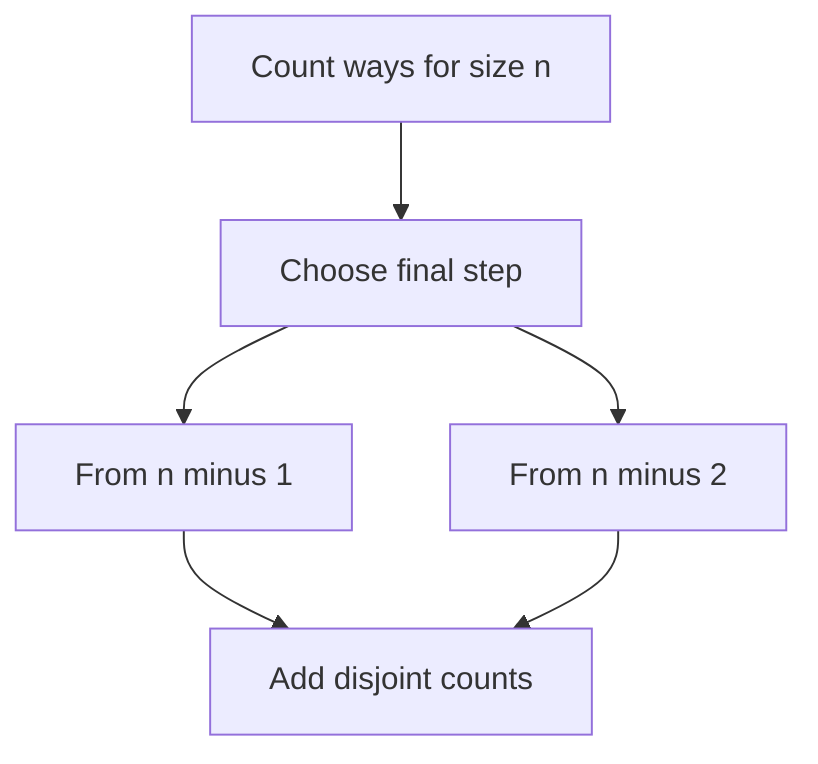

# Chapter 01 — Mathematical Recurrences and Combinatorics

## Core mathematical idea

A recurrence expresses a large answer using smaller answers .

## A representative mathematical model

`F(n)=\sum_{c\in Choices(n)}F(next(n,c))`

For counting, add disjoint cases. For optimization, replace sum with min or max. Base cases must express empty structures correctly.

**Important:** This formula is a pattern template. The precise recurrence for a listed problem must be derived from that problem’s constraints and code.

## State-transition picture

## How to study the linked problems

For each problem: read the mathematical template, articulate its state and decision, inspect the submitted implementation, then justify why its transitions are correct. Compare with the previous problem: which constraint forced a new state dimension?

## Problems in this family (33)

- [62. Unique Paths](Problems/62.md) — Medium
- [70. Climbing Stairs](Problems/70.md) — Easy
- [91. Decode Ways](Problems/91.md) — Medium
- [95. Unique Binary Search Trees II](Problems/95.md) — Medium
- [96. Unique Binary Search Trees](Problems/96.md) — Medium
- [118. Pascal's Triangle](Problems/118.md) — Easy
- [119. Pascal's Triangle II](Problems/119.md) — Easy
- [241. Different Ways to Add Parentheses](Problems/241.md) — Medium
- [264. Ugly Number II](Problems/264.md) — Medium
- [313. Super Ugly Number](Problems/313.md) — Medium
- [338. Counting Bits](Problems/338.md) — Easy
- [397. Integer Replacement](Problems/397.md) — Medium
- [509. Fibonacci Number](Problems/509.md) — Easy
- [639. Decode Ways II](Problems/639.md) — Hard
- [650. 2 Keys Keyboard](Problems/650.md) — Medium
- [746. Min Cost Climbing Stairs](Problems/746.md) — Easy
- [823. Binary Trees With Factors](Problems/823.md) — Medium
- [873. Length of Longest Fibonacci Subsequence](Problems/873.md) — Medium
- [894. All Possible Full Binary Trees](Problems/894.md) — Medium
- [920. Number of Music Playlists](Problems/920.md) — Hard
- [964. Least Operators to Express Number](Problems/964.md) — Hard
- [1137. N-th Tribonacci Number](Problems/1137.md) — Easy
- [1155. Number of Dice Rolls With Target Sum](Problems/1155.md) — Medium
- [1359. Count All Valid Pickup and Delivery Options](Problems/1359.md) — Hard
- [1387. Sort Integers by The Power Value](Problems/1387.md) — Medium
- [1420. Build Array Where You Can Find The Maximum Exactly K Comparisons](Problems/1420.md) — Hard
- [1434. Number of Ways to Wear Different Hats to Each Other](Problems/1434.md) — Hard
- [1569. Number of Ways to Reorder Array to Get Same BST](Problems/1569.md) — Hard
- [1611. Minimum One Bit Operations to Make Integers Zero](Problems/1611.md) — Hard
- [1621. Number of Sets of K Non-Overlapping Line Segments](Problems/1621.md) — Medium
- [1641. Count Sorted Vowel Strings](Problems/1641.md) — Medium
- [1866. Number of Ways to Rearrange Sticks With K Sticks Visible](Problems/1866.md) — Hard
- [1997. First Day Where You Have Been in All the Rooms](Problems/1997.md) — Medium
