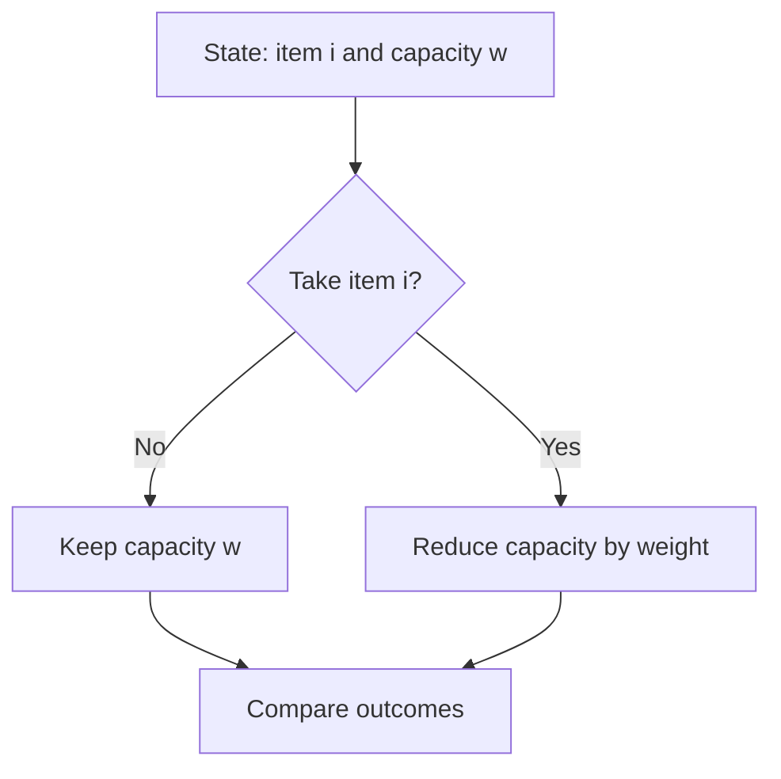

# Chapter 02 — Take-or-Skip and Knapsack

## Core mathematical idea

Each item creates a decision: select or reject .

## A representative mathematical model

`F(i,c)=\max(F(i-1,c),v_i+F(i-1,c-w_i))`

Only use the take branch when the remaining capacity is feasible. Counting versions use addition; feasibility versions use logical OR.

**Important:** This formula is a pattern template. The precise recurrence for a listed problem must be derived from that problem’s constraints and code.

## State-transition picture

## How to study the linked problems

For each problem: read the mathematical template, articulate its state and decision, inspect the submitted implementation, then justify why its transitions are correct. Compare with the previous problem: which constraint forced a new state dimension?

## Problems in this family (27)

- [198. House Robber](Problems/198.md) — Medium
- [213. House Robber II](Problems/213.md) — Medium
- [279. Perfect Squares](Problems/279.md) — Medium
- [322. Coin Change](Problems/322.md) — Medium
- [337. House Robber III](Problems/337.md) — Medium
- [343. Integer Break](Problems/343.md) — Medium
- [377. Combination Sum IV](Problems/377.md) — Medium
- [416. Partition Equal Subset Sum](Problems/416.md) — Medium
- [474. Ones and Zeroes](Problems/474.md) — Medium
- [494. Target Sum](Problems/494.md) — Medium
- [518. Coin Change II](Problems/518.md) — Medium
- [638. Shopping Offers](Problems/638.md) — Medium
- [691. Stickers to Spell Word](Problems/691.md) — Hard
- [740. Delete and Earn](Problems/740.md) — Medium
- [805. Split Array With Same Average](Problems/805.md) — Hard
- [879. Profitable Schemes](Problems/879.md) — Hard
- [956. Tallest Billboard](Problems/956.md) — Hard
- [1049. Last Stone Weight II](Problems/1049.md) — Medium
- [1262. Greatest Sum Divisible by Three](Problems/1262.md) — Medium
- [1449. Form Largest Integer With Digits That Add up to Target](Problems/1449.md) — Hard
- [1477. Find Two Non-overlapping Sub-arrays Each With Target Sum](Problems/1477.md) — Medium
- [1655. Distribute Repeating Integers](Problems/1655.md) — Hard
- [1981. Minimize the Difference Between Target and Chosen Elements](Problems/1981.md) — Medium
- [3444. Minimum Increments for Target Multiples in an Array](Problems/3444.md) — Hard
- [4040. Minimum Operations to Form Subset Sum I](Problems/4040.md) — Medium
- [4041. Minimum Operations to Form Subset Sum II](Problems/4041.md) — Hard
- [4050. Minimum Days to Score Exactly N Points](Problems/4050.md) — Medium
