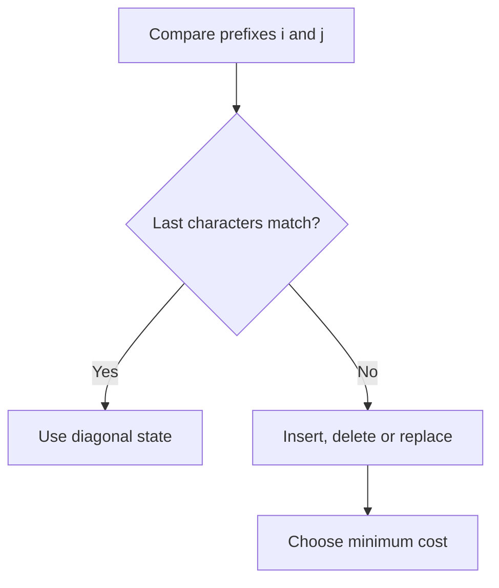

# Chapter 04 — String Matching and Sequence Alignment

## Core mathematical idea

Match prefixes by considering their final symbols .

## A representative mathematical model

`D(i,j)=\min(D(i-1,j)+1,D(i,j-1)+1,D(i-1,j-1)+[a_i\ne b_j])`

The three alternatives correspond to delete, insert and substitute. In matching/counting variants, the aggregation changes.

**Important:** This formula is a pattern template. The precise recurrence for a listed problem must be derived from that problem’s constraints and code.

## State-transition picture

## How to study the linked problems

For each problem: read the mathematical template, articulate its state and decision, inspect the submitted implementation, then justify why its transitions are correct. Compare with the previous problem: which constraint forced a new state dimension?

## Problems in this family (25)

- [10. Regular Expression Matching](Problems/10.md) — Hard
- [44. Wildcard Matching](Problems/44.md) — Hard
- [72. Edit Distance](Problems/72.md) — Medium
- [87. Scramble String](Problems/87.md) — Hard
- [97. Interleaving String](Problems/97.md) — Medium
- [115. Distinct Subsequences](Problems/115.md) — Hard
- [139. Word Break](Problems/139.md) — Medium
- [140. Word Break II](Problems/140.md) — Hard
- [466. Count The Repetitions](Problems/466.md) — Hard
- [472. Concatenated Words](Problems/472.md) — Hard
- [583. Delete Operation for Two Strings](Problems/583.md) — Medium
- [718. Maximum Length of Repeated Subarray](Problems/718.md) — Medium
- [940. Distinct Subsequences II](Problems/940.md) — Hard
- [1035. Uncrossed Lines](Problems/1035.md) — Medium
- [1092. Shortest Common Supersequence](Problems/1092.md) — Hard
- [1143. Longest Common Subsequence](Problems/1143.md) — Medium
- [1320. Minimum Distance to Type a Word Using Two Fingers](Problems/1320.md) — Hard
- [1458. Max Dot Product of Two Subsequences](Problems/1458.md) — Hard
- [1531. String Compression II](Problems/1531.md) — Hard
- [1638. Count Substrings That Differ by One Character](Problems/1638.md) — Medium
- [1639. Number of Ways to Form a Target String Given a Dictionary](Problems/1639.md) — Hard
- [1987. Number of Unique Good Subsequences](Problems/1987.md) — Hard
- [3441. Minimum Cost Good Caption](Problems/3441.md) — Hard
- [3981. Count Distinct Ways to Form Target from Two Strings](Problems/3981.md) — Hard
- [3995. Minimum Cost to Convert String III](Problems/3995.md) — Hard
