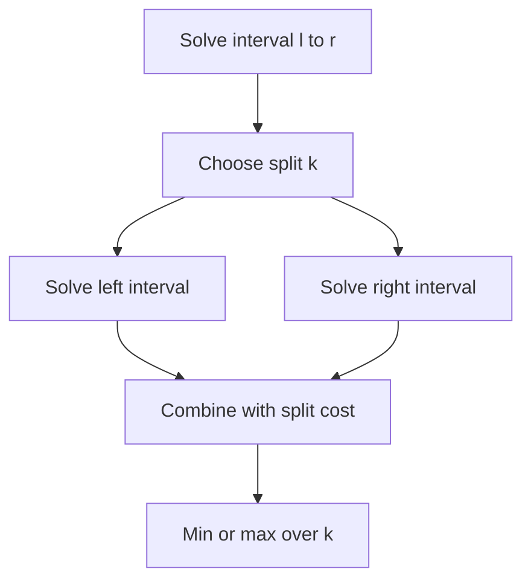

# Chapter 06 — Interval and Partition DP

## Core mathematical idea

Split an interval at a chosen boundary, root, or last operation .

## A representative mathematical model

`F(l,r)=\min_{l\le k<r}(F(l,k)+F(k+1,r)+cost(l,k,r))`

Some interval problems maximize rather than minimize. Choosing the last operation can make otherwise interacting subproblems independent.

**Important:** This formula is a pattern template. The precise recurrence for a listed problem must be derived from that problem’s constraints and code.

## State-transition picture

## How to study the linked problems

For each problem: read the mathematical template, articulate its state and decision, inspect the submitted implementation, then justify why its transitions are correct. Compare with the previous problem: which constraint forced a new state dimension?

## Problems in this family (34)

- [131. Palindrome Partitioning](Problems/131.md) — Medium
- [132. Palindrome Partitioning II](Problems/132.md) — Hard
- [312. Burst Balloons](Problems/312.md) — Hard
- [375. Guess Number Higher or Lower II](Problems/375.md) — Medium
- [410. Split Array Largest Sum](Problems/410.md) — Hard
- [516. Longest Palindromic Subsequence](Problems/516.md) — Medium
- [546. Remove Boxes](Problems/546.md) — Hard
- [553. Optimal Division](Problems/553.md) — Medium
- [647. Palindromic Substrings](Problems/647.md) — Medium
- [664. Strange Printer](Problems/664.md) — Hard
- [730. Count Different Palindromic Subsequences](Problems/730.md) — Hard
- [813. Largest Sum of Averages](Problems/813.md) — Medium
- [877. Stone Game](Problems/877.md) — Medium
- [887. Super Egg Drop](Problems/887.md) — Hard
- [1000. Minimum Cost to Merge Stones](Problems/1000.md) — Hard
- [1039. Minimum Score Triangulation of Polygon](Problems/1039.md) — Medium
- [1105. Filling Bookcase Shelves](Problems/1105.md) — Medium
- [1130. Minimum Cost Tree From Leaf Values](Problems/1130.md) — Medium
- [1140. Stone Game II](Problems/1140.md) — Medium
- [1147. Longest Chunked Palindrome Decomposition](Problems/1147.md) — Hard
- [1278. Palindrome Partitioning III](Problems/1278.md) — Hard
- [1312. Minimum Insertion Steps to Make a String Palindrome](Problems/1312.md) — Hard
- [1335. Minimum Difficulty of a Job Schedule](Problems/1335.md) — Hard
- [1388. Pizza With 3n Slices](Problems/1388.md) — Hard
- [1406. Stone Game III](Problems/1406.md) — Hard
- [1478. Allocate Mailboxes](Problems/1478.md) — Hard
- [1510. Stone Game IV](Problems/1510.md) — Hard
- [1547. Minimum Cost to Cut a Stick](Problems/1547.md) — Hard
- [1690. Stone Game VII](Problems/1690.md) — Medium
- [1745. Palindrome Partitioning IV](Problems/1745.md) — Hard
- [1872. Stone Game VIII](Problems/1872.md) — Hard
- [1884. Egg Drop With 2 Eggs and N Floors](Problems/1884.md) — Medium
- [3414. Maximum Score of Non-overlapping Intervals](Problems/3414.md) — Hard
- [4009. Minimum Possible Maximum Waiting Time](Problems/4009.md) — Hard
