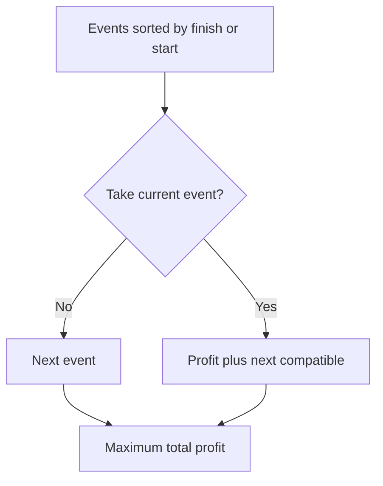

# Chapter 07 — Scheduling and Weighted Intervals

## Core mathematical idea

Sort events and jump to the next compatible event .

## A representative mathematical model

`F(i,k)=\max(F(i+1,k),w_i+F(next(i),k-1))`

For inclusive intervals, compatibility requires next.start > current.end. Binary search can find next(i).

**Important:** This formula is a pattern template. The precise recurrence for a listed problem must be derived from that problem’s constraints and code.

## State-transition picture

## How to study the linked problems

For each problem: read the mathematical template, articulate its state and decision, inspect the submitted implementation, then justify why its transitions are correct. Compare with the previous problem: which constraint forced a new state dimension?

## Problems in this family (12)

- [121. Best Time to Buy and Sell Stock](Problems/121.md) — Easy
- [689. Maximum Sum of 3 Non-Overlapping Subarrays](Problems/689.md) — Hard
- [983. Minimum Cost For Tickets](Problems/983.md) — Medium
- [1031. Maximum Sum of Two Non-Overlapping Subarrays](Problems/1031.md) — Medium
- [1235. Maximum Profit in Job Scheduling](Problems/1235.md) — Hard
- [1687. Delivering Boxes from Storage to Ports](Problems/1687.md) — Hard
- [1751. Maximum Number of Events That Can Be Attended II](Problems/1751.md) — Hard
- [2008. Maximum Earnings From Taxi](Problems/2008.md) — Medium
- [2054. Two Best Non-Overlapping Events](Problems/2054.md) — Medium
- [4023. Elevator Requests II](Problems/4023.md) — Hard
- [4027. Elevator Requests III](Problems/4027.md) — Hard
- [4068. Maximize Meeting Earnings with Idle Gaps](Problems/4068.md) — Hard
