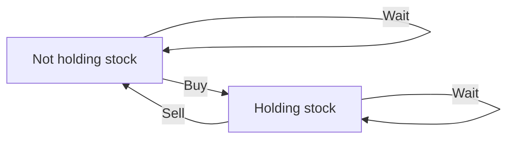

# Chapter 08 — State Machines and Stock DP

## Core mathematical idea

The state represents a legal mode or finite history .

## A representative mathematical model

`F(i,s)=\operatorname{opt}_{p\to s}(F(i-1,p)+cost(p,s,i))`

Examples include holding stock versus not holding, cooldown, and bounded operation counts. Draw a state-transition graph before coding.

**Important:** This formula is a pattern template. The precise recurrence for a listed problem must be derived from that problem’s constraints and code.

## State-transition picture

## How to study the linked problems

For each problem: read the mathematical template, articulate its state and decision, inspect the submitted implementation, then justify why its transitions are correct. Compare with the previous problem: which constraint forced a new state dimension?

## Problems in this family (22)

- [123. Best Time to Buy and Sell Stock III](Problems/123.md) — Hard
- [188. Best Time to Buy and Sell Stock IV](Problems/188.md) — Hard
- [309. Best Time to Buy and Sell Stock with Cooldown](Problems/309.md) — Medium
- [552. Student Attendance Record II](Problems/552.md) — Hard
- [678. Valid Parenthesis String](Problems/678.md) — Medium
- [714. Best Time to Buy and Sell Stock with Transaction Fee](Problems/714.md) — Medium
- [790. Domino and Tromino Tiling](Problems/790.md) — Medium
- [801. Minimum Swaps To Make Sequences Increasing](Problems/801.md) — Hard
- [818. Race Car](Problems/818.md) — Hard
- [926. Flip String to Monotone Increasing](Problems/926.md) — Medium
- [975. Odd Even Jump](Problems/975.md) — Hard
- [1025. Divisor Game](Problems/1025.md) — Easy
- [1220. Count Vowels Permutation](Problems/1220.md) — Hard
- [1223. Dice Roll Simulation](Problems/1223.md) — Hard
- [1255. Maximum Score Words Formed by Letters](Problems/1255.md) — Hard
- [1411. Number of Ways to Paint N × 3 Grid](Problems/1411.md) — Hard
- [1653. Minimum Deletions to Make String Balanced](Problems/1653.md) — Medium
- [1787. Make the XOR of All Segments Equal to Zero](Problems/1787.md) — Hard
- [3389. Minimum Operations to Make Character Frequencies Equal](Problems/3389.md) — Hard
- [3434. Maximum Frequency After Subarray Operation](Problems/3434.md) — Medium
- [3980. Minimum Operations to Transform Binary String](Problems/3980.md) — Medium
- [3984. Divisible Game](Problems/3984.md) — Medium
