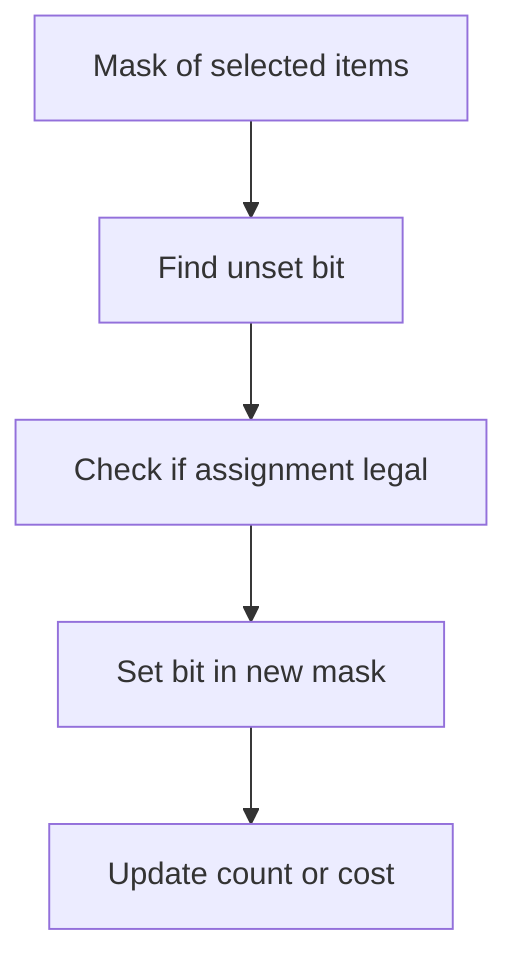

# Chapter 09 — Bitmask, Assignment and Subset DP

## Core mathematical idea

Represent a chosen subset as bits of an integer .

## A representative mathematical model

`F(mask)=\operatorname{opt}_{i\notin mask}(cost(mask,i)+F(mask\cup\{i\}))`

There are 2^n subsets. Each transition adds or removes one element, subject to feasibility.

**Important:** This formula is a pattern template. The precise recurrence for a listed problem must be derived from that problem’s constraints and code.

## State-transition picture

## How to study the linked problems

For each problem: read the mathematical template, articulate its state and decision, inspect the submitted implementation, then justify why its transitions are correct. Compare with the previous problem: which constraint forced a new state dimension?

## Problems in this family (19)

- [464. Can I Win](Problems/464.md) — Medium
- [473. Matchsticks to Square](Problems/473.md) — Medium
- [526. Beautiful Arrangement](Problems/526.md) — Medium
- [698. Partition to K Equal Sum Subsets](Problems/698.md) — Medium
- [773. Sliding Puzzle](Problems/773.md) — Hard
- [847. Shortest Path Visiting All Nodes](Problems/847.md) — Hard
- [943. Find the Shortest Superstring](Problems/943.md) — Hard
- [996. Number of Squareful Arrays](Problems/996.md) — Hard
- [1125. Smallest Sufficient Team](Problems/1125.md) — Hard
- [1349. Maximum Students Taking Exam](Problems/1349.md) — Hard
- [1494. Parallel Courses II](Problems/1494.md) — Hard
- [1595. Minimum Cost to Connect Two Groups of Points](Problems/1595.md) — Hard
- [1723. Find Minimum Time to Finish All Jobs](Problems/1723.md) — Hard
- [1755. Closest Subsequence Sum](Problems/1755.md) — Hard
- [1815. Maximum Number of Groups Getting Fresh Donuts](Problems/1815.md) — Hard
- [1947. Maximum Compatibility Score Sum](Problems/1947.md) — Medium
- [1986. Minimum Number of Work Sessions to Finish the Tasks](Problems/1986.md) — Medium
- [2035. Partition Array Into Two Arrays to Minimize Sum Difference](Problems/2035.md) — Hard
- [2050. Parallel Courses III](Problems/2050.md) — Hard
