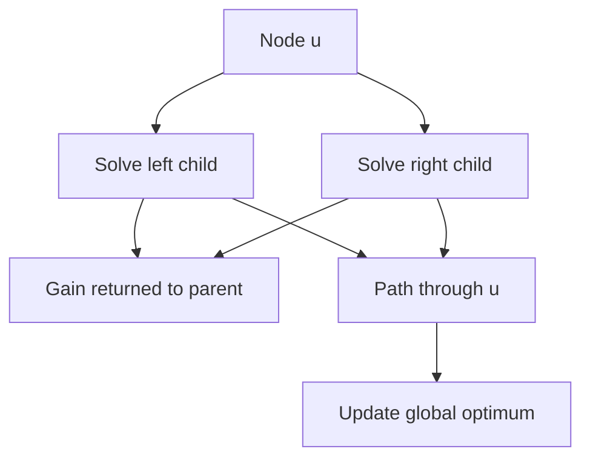

# Chapter 10 — Tree, Graph and DAG DP

## Core mathematical idea: solve subtrees, then combine them

A rooted tree has no cycles, so once we solve the children of a node, we can solve the node. A **state** must describe exactly what information the parent needs. This is different from a global answer: a path sent upward cannot branch into both children.

### Derive the recurrence — 124. Binary Tree Maximum Path Sum

Let `gain(u)` be the maximum sum of a **single downward path** beginning at node `u`. We can reject negative child contributions:

- `L = max(0, gain(left(u)))`
- `R = max(0, gain(right(u)))`
- `gain(u) = value(u) + max(L, R)`
- `answer = max(answer, value(u) + L + R)`

**Why two formulas?** The path returned to the parent must have one branch, but a complete path passing through `u` may use both branches. This distinction is the key invariant.

For a root of `-10`, with left child `9` and right subtree rooted at `20` having children `15` and `7`, the best complete path is `15 → 20 → 7`, worth **42**. Returning both branches to the parent would be invalid.

### Different graph problems require different mathematics

| Problem | Correct governing idea |
|---|---|
| 124. Binary Tree Maximum Path Sum | Postorder DP: downward gain versus global path |
| 329. Longest Increasing Path | Memoized DFS on strictly increasing edges, forming a DAG |
| 834. Sum of Distances in Tree | Two-pass rerooting DP |
| 968. Binary Tree Cameras | Tree states describing covered / camera / uncovered |
| 1786. Restricted Paths | Count paths along edges with decreasing shortest-path distance |
| 1857. Largest Color Value | Topological order plus per-color path counts |
| 1976. Number of Ways to Arrive | Dijkstra distance plus count of shortest paths |

**Do not reuse a probability recurrence for these problems.** Some linked problems use BFS, shortest paths, binary lifting, or graph structure rather than conventional DP.

## State-transition picture

## How to study the linked problems

For each problem: read the mathematical template, articulate its state and decision, inspect the submitted implementation, then justify why its transitions are correct. Compare with the previous problem: which constraint forced a new state dimension?

## Problems in this family (20)

- [124. Binary Tree Maximum Path Sum](Problems/124.md) — Hard
- [329. Longest Increasing Path in a Matrix](Problems/329.md) — Hard
- [458. Poor Pigs](Problems/458.md) — Hard
- [542. 01 Matrix](Problems/542.md) — Medium
- [787. Cheapest Flights Within K Stops](Problems/787.md) — Medium
- [834. Sum of Distances in Tree](Problems/834.md) — Hard
- [968. Binary Tree Cameras](Problems/968.md) — Hard
- [1162. As Far from Land as Possible](Problems/1162.md) — Medium
- [1334. Find the City With the Smallest Number of Neighbors at a Threshold Distance](Problems/1334.md) — Medium
- [1372. Longest ZigZag Path in a Binary Tree](Problems/1372.md) — Medium
- [1373. Maximum Sum BST in Binary Tree](Problems/1373.md) — Hard
- [1483. Kth Ancestor of a Tree Node](Problems/1483.md) — Hard
- [1617. Count Subtrees With Max Distance Between Cities](Problems/1617.md) — Hard
- [1786. Number of Restricted Paths From First to Last Node](Problems/1786.md) — Medium
- [1857. Largest Color Value in a Directed Graph](Problems/1857.md) — Hard
- [1916. Count Ways to Build Rooms in an Ant Colony](Problems/1916.md) — Hard
- [1928. Minimum Cost to Reach Destination in Time](Problems/1928.md) — Hard
- [1976. Number of Ways to Arrive at Destination](Problems/1976.md) — Medium
- [2003. Smallest Missing Genetic Value in Each Subtree](Problems/2003.md) — Hard
- [2127. Maximum Employees to Be Invited to a Meeting](Problems/2127.md) — Hard
