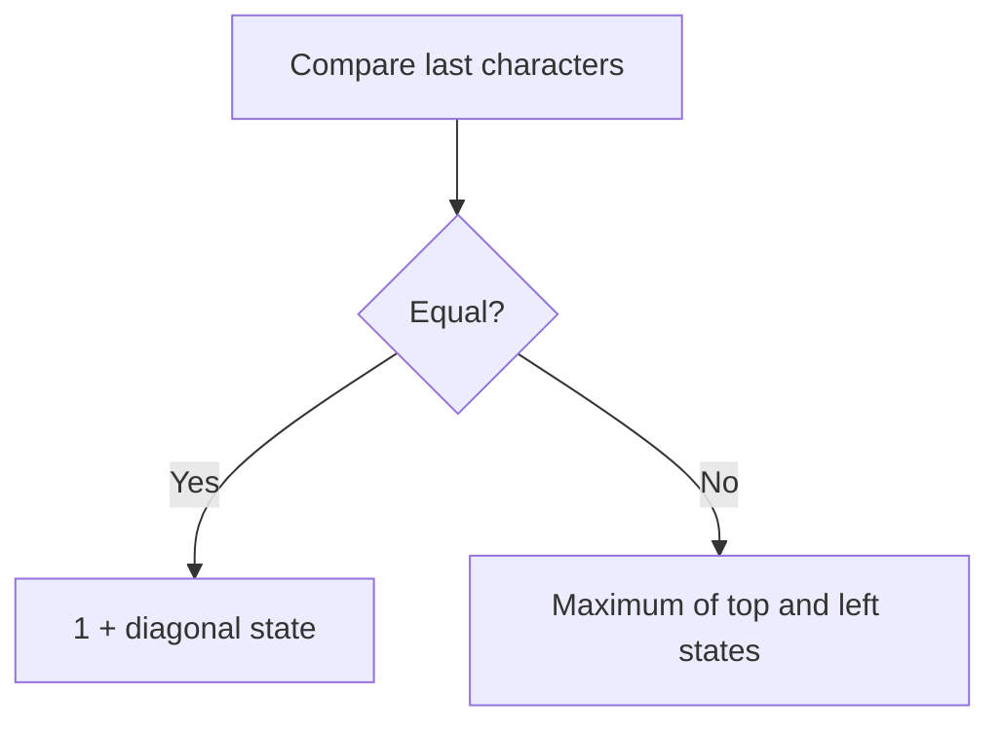

# 1143. Longest Common Subsequence

**Difficulty:** Medium  
**Concept family:** [String Matching and Sequence Alignment](../Theory/Chapter-04.md)  
**Problem:** https://leetcode.com/problems/longest-common-subsequence/  
**Original submission:** https://leetcode.com/submissions/detail/1540742983/

## Understand the mathematics first

Match or skip final symbols of two prefixes.

### Model / useful recurrence

`L(i,j)=1+L(i-1,j-1) if equal, else max(L(i-1,j),L(i,j-1))`

**Why this helps:** Classic sequence alignment.

**Derivation exercise:** Define exactly what each state variable means for this problem; list valid choices, base cases, and forbidden transitions. Check the submitted code against that invariant. The family template alone is not a substitute for a problem-specific proof.

## Code landmarks

- `curr[j] = max(prev[j], curr[j - 1]);`

## Worked mathematical walkthrough (illustrated)

**State:** L(i,j): LCS length of first i chars of A and first j of B.

**Transition:** `If A[i-1]=B[j-1]: L(i,j)=1+L(i-1,j-1); else max(L(i-1,j),L(i,j-1))`

**Why:** If last characters match, extend a smaller optimal match. Otherwise at least one of the last characters is unused in an optimal common subsequence.



**Hand calculation:** A="abc", B="ac": row for empty A [0,0,0]; a [0,1,1]; ab [0,1,1]; abc [0,1,2]. Answer 2.

**Six-month revision test:** Without looking at the code, reconstruct the state, enumerate the legal choices, and justify why this transition does not miss or double-count any answer.

---

## Your original Accepted C++ submission (unaltered)

```cpp
class Solution {
public:
    int longestCommonSubsequence(string text1, string text2) {
    int m = text1.size(), n = text2.size();
    vector<int> prev(n + 1, 0), curr(n + 1, 0);

    for (int i = 1; i <= m; ++i) {
        for (int j = 1; j <= n; ++j) {
            if (text1[i - 1] == text2[j - 1]) {
                curr[j] = 1 + prev[j - 1];
            } else {
                curr[j] = max(prev[j], curr[j - 1]);
            }
        }
        prev = curr;
    }

    return prev[n];
}
};
```

## Interview self-check

1. What is the smallest state that determines the remaining answer?
2. Why are the transitions exhaustive and valid?
3. What is the exact base case, including empty and impossible cases?
4. What is the time complexity (states × work per state)?
5. Can the memory be compressed without overwriting needed dependencies?
