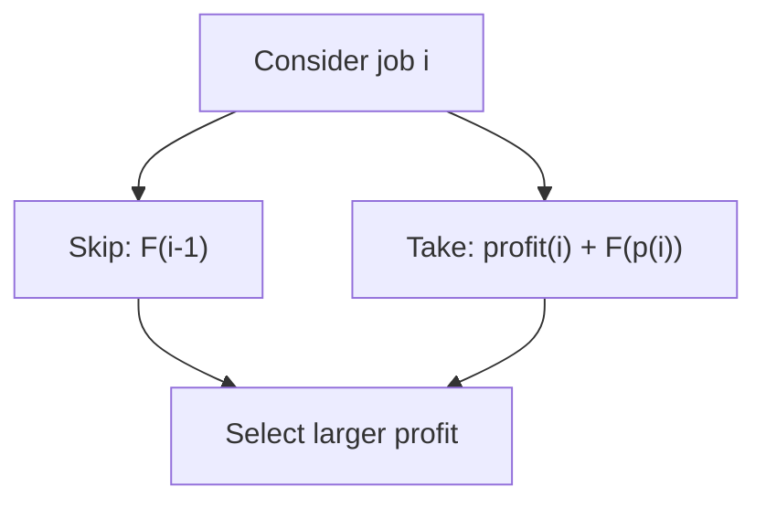

# 1235. Maximum Profit in Job Scheduling

**Difficulty:** Hard  
**Concept family:** [Scheduling and Weighted Intervals](../Theory/Chapter-07.md)  
**Problem:** https://leetcode.com/problems/maximum-profit-in-job-scheduling/  
**Original submission:** https://leetcode.com/submissions/detail/1490302021/

## Understand the mathematics first

Choose a job or jump to the next compatible job.

### Model / useful recurrence

`F(i)=max(F(i+1),profit_i+F(next(i)))`

**Why this helps:** Weighted interval scheduling.

**Derivation exercise:** Define exactly what each state variable means for this problem; list valid choices, base cases, and forbidden transitions. Check the submitted code against that invariant. The family template alone is not a substitute for a problem-specific proof.

## Code landmarks

- `sort(jobs.begin(), jobs.end());`
- `int profit = prev(dp.upper_bound(job[1]))->second + job[2];`
- `dp[job[0]] = profit;`

## Worked mathematical walkthrough (illustrated)

**State:** F(i): maximum profit using first i jobs sorted by finish time.

**Transition:** `F(i)=max(F(i-1),profit[i]+F(p(i))) where p(i) is the last compatible job`

**Why:** For each job, skip it or include it and combine with the best compatible prefix. Sorting makes that prefix well-defined.



**Hand calculation:** Jobs (1,3,$50), (2,4,$10), (3,5,$40): F(1)=50, F(2)=50, F(3)=90.

**Six-month revision test:** Without looking at the code, reconstruct the state, enumerate the legal choices, and justify why this transition does not miss or double-count any answer.

---

## Your original Accepted C++ submission (unaltered)

```cpp
class Solution 
{
public:
    int jobScheduling(vector<int>& startTime, vector<int>& endTime, vector<int>& profit) 
	{
        const int n = startTime.size();
        vector<vector<int>> jobs(n);
        for (int i = 0; i < n; i++) 
		{
			jobs[i] = {endTime[i], startTime[i], profit[i]};
		}
        sort(jobs.begin(), jobs.end());

        map<int, int> dp = {{0, 0}};
        for (auto& job : jobs) 
		{
            int profit = prev(dp.upper_bound(job[1]))->second + job[2];
            
            if (profit > dp.rbegin()->second) 
			{
				dp[job[0]] = profit;
			}
        }
        return dp.rbegin()->second;
    }
};
```

## Interview self-check

1. What is the smallest state that determines the remaining answer?
2. Why are the transitions exhaustive and valid?
3. What is the exact base case, including empty and impossible cases?
4. What is the time complexity (states × work per state)?
5. Can the memory be compressed without overwriting needed dependencies?
