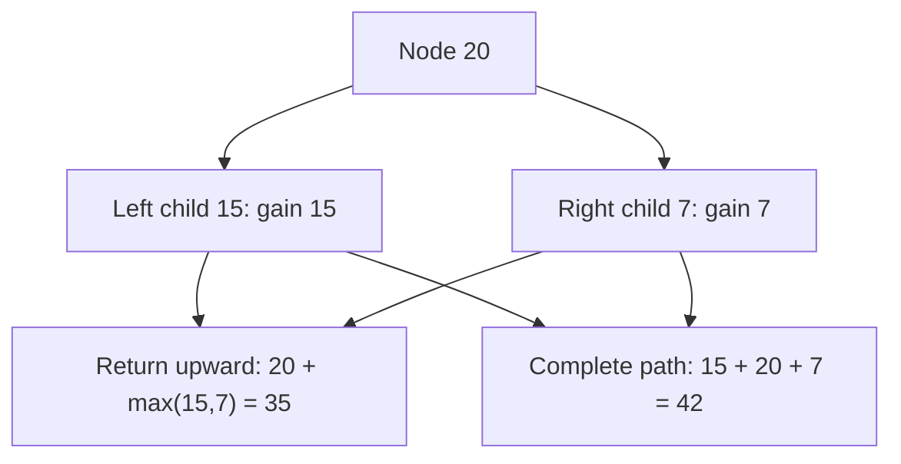

# 124. Binary Tree Maximum Path Sum

**Difficulty:** Hard  
**Concept family:** [Tree, Graph and DAG DP](../Theory/Chapter-10.md)  
**Problem:** https://leetcode.com/problems/binary-tree-maximum-path-sum/  
**Original submission:** https://leetcode.com/submissions/detail/1542393123/

## Understand the mathematics first

This problem belongs to the study family **Tree, Graph and DAG DP**. Start by defining the objective and minimal sufficient state; inspect the code to identify the actual transitions.

### Mathematical starting point

This family includes tree DP, DAG DP, shortest paths, and graph traversal. **There is no single recurrence for all these problems.** Identify the exact state and invariant from the algorithm below. For tree paths, distinguish the value returned to the parent from a complete answer within the subtree; for graph problems, establish whether edges form a DAG or whether shortest-path processing is required.

## Code landmarks

- `int leftGain = max(0, maxGain(node->left, maxSum)); // Ignore negative paths`
- `int rightGain = max(0, maxGain(node->right, maxSum));`
- `maxSum = max(maxSum, newPathSum);`

## Worked mathematical walkthrough (illustrated)

**State:** Gain(u): maximum downward path beginning at u; Answer: maximum path anywhere.

**Transition:** `Gain(u)=value(u)+max(0,Gain(left),Gain(right)); through(u)=value(u)+max(0,Gain(left))+max(0,Gain(right))`

**Why:** A path returned to the parent cannot branch in two directions. A complete path evaluated at the current node may use both children.



**Hand calculation:** Tree [-10,9,20,null,null,15,7]: at 20, downward gain is 35, through-node candidate is 42 (=15+20+7).

**Six-month revision test:** Without looking at the code, reconstruct the state, enumerate the legal choices, and justify why this transition does not miss or double-count any answer.

---

## Your original Accepted C++ submission (unaltered)

```cpp
/**
 * Definition for a binary tree node.
 * struct TreeNode {
 *     int val;
 *     TreeNode *left;
 *     TreeNode *right;
 *     TreeNode() : val(0), left(nullptr), right(nullptr) {}
 *     TreeNode(int x) : val(x), left(nullptr), right(nullptr) {}
 *     TreeNode(int x, TreeNode *left, TreeNode *right) : val(x), left(left), right(right) {}
 * };
 */
class Solution {
public:
    int maxPathSum(TreeNode* root) {
        int maxSum = INT_MIN;
        maxGain(root, maxSum);
        return maxSum;
    }
    
private:
    int maxGain(TreeNode* node, int& maxSum) {
        if (!node) return 0;
        
        // Recursively calculate max sum from left and right subtrees
        int leftGain = max(0, maxGain(node->left, maxSum)); // Ignore negative paths
        int rightGain = max(0, maxGain(node->right, maxSum));
        
        // Compute max path sum considering current node as the root
        int newPathSum = node->val + leftGain + rightGain;
        
        // Update global maxSum if new path sum is greater
        maxSum = max(maxSum, newPathSum);
        
        // Return max gain including the current node
        return node->val + max(leftGain, rightGain);
    }
};
```

## Interview self-check

1. What is the smallest state that determines the remaining answer?
2. Why are the transitions exhaustive and valid?
3. What is the exact base case, including empty and impossible cases?
4. What is the time complexity (states × work per state)?
5. Can the memory be compressed without overwriting needed dependencies?
