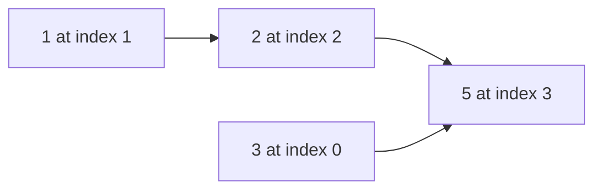

# 300. Longest Increasing Subsequence

**Difficulty:** Medium  
**Concept family:** [Subsequence and Ordering DP](../Theory/Chapter-05.md)  
**Problem:** https://leetcode.com/problems/longest-increasing-subsequence/  
**Original submission:** https://leetcode.com/submissions/detail/1542496094/

## Understand the mathematics first

Find best increasing subsequence ending at each position.

### Model / useful recurrence

`L(i)=1+max_{j<i,a_j<a_i}L(j)`

**Why this helps:** Can optimize with tails + binary search, but tails is not a literal subsequence.

**Derivation exercise:** Define exactly what each state variable means for this problem; list valid choices, base cases, and forbidden transitions. Check the submitted code against that invariant. The family template alone is not a substitute for a problem-specific proof.

## Code landmarks

- `auto it = std::lower_bound(lis.begin(), lis.end(), num);`

## Worked mathematical walkthrough (illustrated)

**State:** L(i): best increasing subsequence ending exactly at i.

**Transition:** `L(i)=1+max(L(j) for j<i and a[j]<a[i]); empty maximum=0`

**Why:** Choose the previous element of the subsequence. The strict inequality makes the transition legal; taking the maximum finds the best predecessor.



**Hand calculation:** [3,1,2,5]: L = [1,1,2,3]. The LIS is [1,2,5], length 3.

**Six-month revision test:** Without looking at the code, reconstruct the state, enumerate the legal choices, and justify why this transition does not miss or double-count any answer.

---

## Your original Accepted C++ submission (unaltered)

```cpp
class Solution {
public:
    int lengthOfLIS(std::vector<int>& nums) {
        std::vector<int> lis;
        for (int num : nums) {
            auto it = std::lower_bound(lis.begin(), lis.end(), num);
            if (it == lis.end()) lis.push_back(num);
            else *it = num;
        }
        return lis.size();
    }
};
```

## Interview self-check

1. What is the smallest state that determines the remaining answer?
2. Why are the transitions exhaustive and valid?
3. What is the exact base case, including empty and impossible cases?
4. What is the time complexity (states × work per state)?
5. Can the memory be compressed without overwriting needed dependencies?
