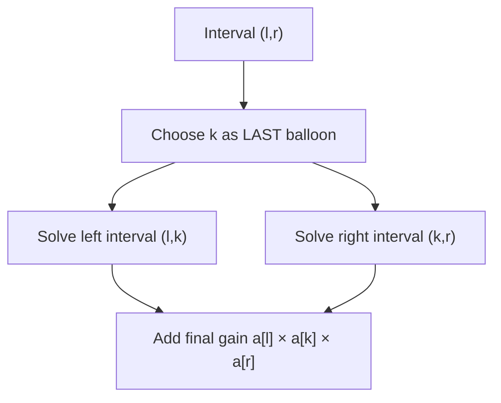

# 312. Burst Balloons

**Difficulty:** Hard  
**Concept family:** [Interval and Partition DP](../Theory/Chapter-06.md)  
**Problem:** https://leetcode.com/problems/burst-balloons/  
**Original submission:** https://leetcode.com/submissions/detail/1541009965/

## Understand the mathematics first

This problem belongs to the study family **Interval and Partition DP**. Start by defining the objective and minimal sufficient state; inspect the code to identify the actual transitions.

### Model / useful recurrence

`F(l,r)=\min_{l\le k<r}(F(l,k)+F(k+1,r)+cost(l,k,r))`

**Why this helps:** Some interval problems maximize rather than minimize. Choosing the last operation can make otherwise interacting subproblems independent.

**Derivation exercise:** Define exactly what each state variable means for this problem; list valid choices, base cases, and forbidden transitions. Check the submitted code against that invariant. The family template alone is not a substitute for a problem-specific proof.

## Code landmarks

- `coins += dp[left][k - 1]; // Left subarray`
- `coins += dp[k + 1][right]; // Right subarray`
- `dp[left][right] = max(dp[left][right], coins);`

## Worked mathematical walkthrough (illustrated)

**State:** D(l,r): maximum coins bursting balloons strictly between boundaries l and r.

**Transition:** `D(l,r)=max over l<k<r of [D(l,k)+D(k,r)+a[l]*a[k]*a[r]]`

**Why:** Choosing the FIRST balloon leaves changing neighbors; choosing the LAST makes the interval boundaries fixed. This is the crucial mathematical trick.



**Hand calculation:** Padded [1,3,1,5,1]: choose a balloon k to burst LAST in an interval, after its interior neighbors have gone.

**Six-month revision test:** Without looking at the code, reconstruct the state, enumerate the legal choices, and justify why this transition does not miss or double-count any answer.

---

## Your original Accepted C++ submission (unaltered)

```cpp
class Solution {
public:
    int maxCoins(vector<int>& nums) {
        int n = nums.size();
        
        // Add virtual balloons with value 1 at both ends
        nums.insert(nums.begin(), 1);
        nums.push_back(1);
        
        // DP table
        vector<vector<int>> dp(n + 2, vector<int>(n + 2, 0));
        
        // Fill the DP table
        for (int len = 1; len <= n; ++len) { // Length of the subarray
            for (int left = 1; left <= n - len + 1; ++left) {
                int right = left + len - 1;
                
                // Find the maximum coins for the subarray nums[left:right]
                for (int k = left; k <= right; ++k) {
                    // Coins gained by bursting balloon k last
                    int coins = nums[left - 1] * nums[k] * nums[right + 1];
                    coins += dp[left][k - 1]; // Left subarray
                    coins += dp[k + 1][right]; // Right subarray
                    dp[left][right] = max(dp[left][right], coins);
                }
            }
        }
        
        // The result is the maximum coins for the entire array
        return dp[1][n];
    }
};
```

## Interview self-check

1. What is the smallest state that determines the remaining answer?
2. Why are the transitions exhaustive and valid?
3. What is the exact base case, including empty and impossible cases?
4. What is the time complexity (states × work per state)?
5. Can the memory be compressed without overwriting needed dependencies?
