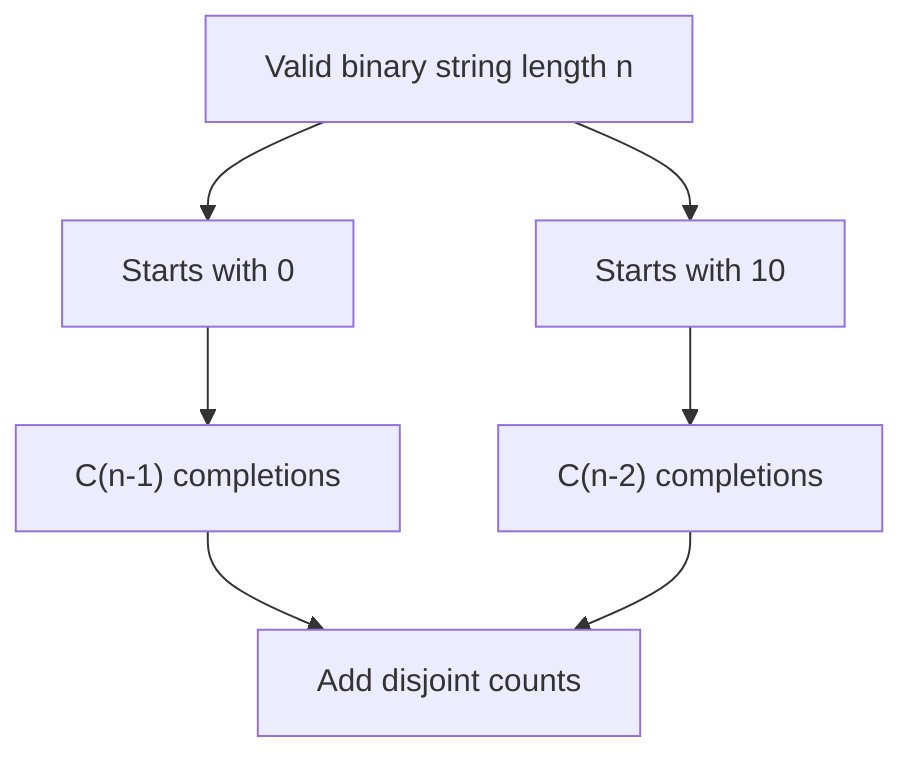

# 600. Non-negative Integers without Consecutive Ones

**Difficulty:** Hard  
**Concept family:** [Digit DP, Counting and Probability](../Theory/Chapter-11.md)  
**Problem:** https://leetcode.com/problems/non-negative-integers-without-consecutive-ones/  
**Original submission:** https://leetcode.com/submissions/detail/1593694865/

## Understand the mathematics first

This problem belongs to the study family **Digit DP, Counting and Probability**. Start by defining the objective and minimal sufficient state; inspect the code to identify the actual transitions.

### Model / useful recurrence

`bestEnding(i)=\max(a_i,a_i+bestEnding(i-1))`

**Why this helps:** This is Kadane’s recurrence; other problems in this group may use greedy, stacks, two pointers, prefix sums, or a specialized optimization—not necessarily DP.

**Derivation exercise:** Define exactly what each state variable means for this problem; list valid choices, base cases, and forbidden transitions. Check the submitted code against that invariant. The family template alone is not a substitute for a problem-specific proof.

## Code landmarks

- `dp[0] = 1;`
- `dp[1] = 2;`
- `dp[i] = dp[i - 1] + dp[i - 2];`

## Worked mathematical walkthrough (illustrated)

**State:** C(n): binary strings of length n without adjacent ones.

**Transition:** `C(n)=C(n-1)+C(n-2), with C(0)=1 and C(1)=2`

**Why:** Split valid strings by their beginning: starting with 0 leaves n-1 unrestricted valid positions; starting with 10 leaves n-2. Counting numbers ≤N adds a tight-bound condition.



**Hand calculation:** Length 3 strings: 000,001,010,100,101. Thus C(3)=5.

**Six-month revision test:** Without looking at the code, reconstruct the state, enumerate the legal choices, and justify why this transition does not miss or double-count any answer.

---

## Your original Accepted C++ submission (unaltered)

```cpp
class Solution {
public:
    int findIntegers(int n) {
        vector<int> dp(31, 0);
        dp[0] = 1;
        dp[1] = 2;

        for (int i = 2; i < 31; ++i)
            dp[i] = dp[i - 1] + dp[i - 2];

        int res = 0, prevBit = 0;
        for (int i = 29; i >= 0; --i) {
            if ((n & (1 << i)) != 0) {
                res += dp[i];
                if (prevBit) return res;
                prevBit = 1;
            } else {
                prevBit = 0;
            }
        }

        return res + 1;
    }
};
```

## Interview self-check

1. What is the smallest state that determines the remaining answer?
2. Why are the transitions exhaustive and valid?
3. What is the exact base case, including empty and impossible cases?
4. What is the time complexity (states × work per state)?
5. Can the memory be compressed without overwriting needed dependencies?
