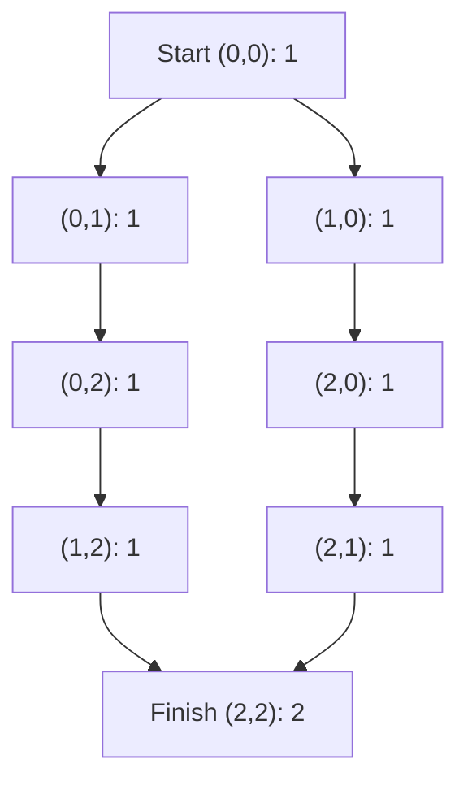

# 63. Unique Paths II

**Difficulty:** Medium  
**Concept family:** [Grid Paths and Geometric DP](../Theory/Chapter-03.md)  
**Problem:** https://leetcode.com/problems/unique-paths-ii/  
**Original submission:** https://leetcode.com/submissions/detail/1536202601/

## Understand the mathematics first

Each unblocked cell inherits paths from top and left.

### Model / useful recurrence

`W(i,j)=W(i-1,j)+W(i,j-1)`

**Why this helps:** Obstacles force W(i,j)=0; one-row compression.

**Derivation exercise:** Define exactly what each state variable means for this problem; list valid choices, base cases, and forbidden transitions. Check the submitted code against that invariant. The family template alone is not a substitute for a problem-specific proof.

## Code landmarks

- `dp[0] = 1; // Start point`
- `dp[j] = 0; // No path through an obstacle`
- `dp[j] += dp[j - 1]; // Add paths from the left cell`

## Worked mathematical walkthrough (illustrated)

**State:** Number of valid routes ending at cell r,c.

**Transition:** `P(r,c)=P(r-1,c)+P(r,c-1) for unblocked cells; otherwise 0`

**Why:** Every arrival comes from above or left. Since the last move is different, the two sets of paths do not overlap. Blocked cells contribute zero.



**Hand calculation:** 3×3 grid with obstacle at (1,1): row 0 = [1,1,1]; row 1 = [1,0,1]; row 2 = [1,1,2]. Answer 2.

**Six-month revision test:** Without looking at the code, reconstruct the state, enumerate the legal choices, and justify why this transition does not miss or double-count any answer.

---

## Your original Accepted C++ submission (unaltered)

```cpp
class Solution 
{
public:
    int uniquePathsWithObstacles(vector<vector<int>>& obstacleGrid) 
    {
        int m = obstacleGrid.size();
        int n = obstacleGrid[0].size();
        
        // If the starting point or ending point is blocked, no paths are possible
        if (obstacleGrid[0][0] == 1 || obstacleGrid[m-1][n-1] == 1) 
        {
            return 0;
        }
        
        // DP array to store the number of ways to reach each cell in the current row
        vector<int> dp(n, 0);
        dp[0] = 1; // Start point
        
        for (int i = 0; i < m; ++i) 
        {
            for (int j = 0; j < n; ++j) 
            {
                if (obstacleGrid[i][j] == 1) 
                {
                    dp[j] = 0; // No path through an obstacle
                } 
                else if (j > 0) 
                {
                    dp[j] += dp[j - 1]; // Add paths from the left cell
                }
            }
        }
        
        return dp[n - 1];
    }
};
```

## Interview self-check

1. What is the smallest state that determines the remaining answer?
2. Why are the transitions exhaustive and valid?
3. What is the exact base case, including empty and impossible cases?
4. What is the time complexity (states × work per state)?
5. Can the memory be compressed without overwriting needed dependencies?
