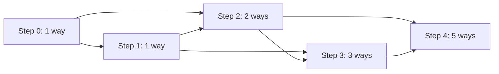

# 70. Climbing Stairs

**Difficulty:** Easy  
**Concept family:** [Mathematical Recurrences and Combinatorics](../Theory/Chapter-01.md)  
**Problem:** https://leetcode.com/problems/climbing-stairs/  
**Original submission:** https://leetcode.com/submissions/detail/487837996/

## Understand the mathematics first

Condition on whether the final climb was one or two steps.

### Model / useful recurrence

`W(n)=W(n-1)+W(n-2)`

**Why this helps:** Fibonacci-like counting; your submitted base-case code deserves checking at n=2.

**Derivation exercise:** Define exactly what each state variable means for this problem; list valid choices, base cases, and forbidden transitions. Check the submitted code against that invariant. The family template alone is not a substitute for a problem-specific proof.

## Code landmarks

Read the loops, recursion, and boundary conditions in the original code.

## Worked mathematical walkthrough (illustrated)

**State:** Ways to reach step i.

**Transition:** `W(i)=W(i-1)+W(i-2)`

**Why:** Every valid path ends in a one-step or two-step move. These endings are disjoint, so add the counts.



**Hand calculation:** n=4: W(0)=1, W(1)=1, W(2)=2, W(3)=3, W(4)=5

**Six-month revision test:** Without looking at the code, reconstruct the state, enumerate the legal choices, and justify why this transition does not miss or double-count any answer.

---

## Your original Accepted C++ submission (unaltered)

```cpp
class Solution 
{
public:
    int climbStairs(int n) 
    {
        if ( (n==1) || (n==0) )
        {
            return n ;
        }
        int a = 0 , b = 1 , c = 0 , i = 0 ;
        
        for(i=0;i<n;i++)
        {
            c = a + b ;
            a = b ;
            b = c ;
        }
        return c ;
    }
};
```

## Interview self-check

1. What is the smallest state that determines the remaining answer?
2. Why are the transitions exhaustive and valid?
3. What is the exact base case, including empty and impossible cases?
4. What is the time complexity (states × work per state)?
5. Can the memory be compressed without overwriting needed dependencies?
