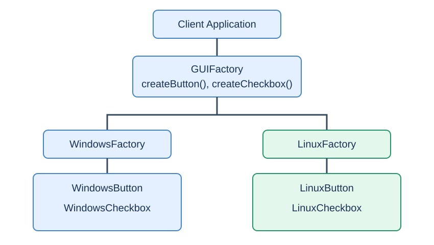
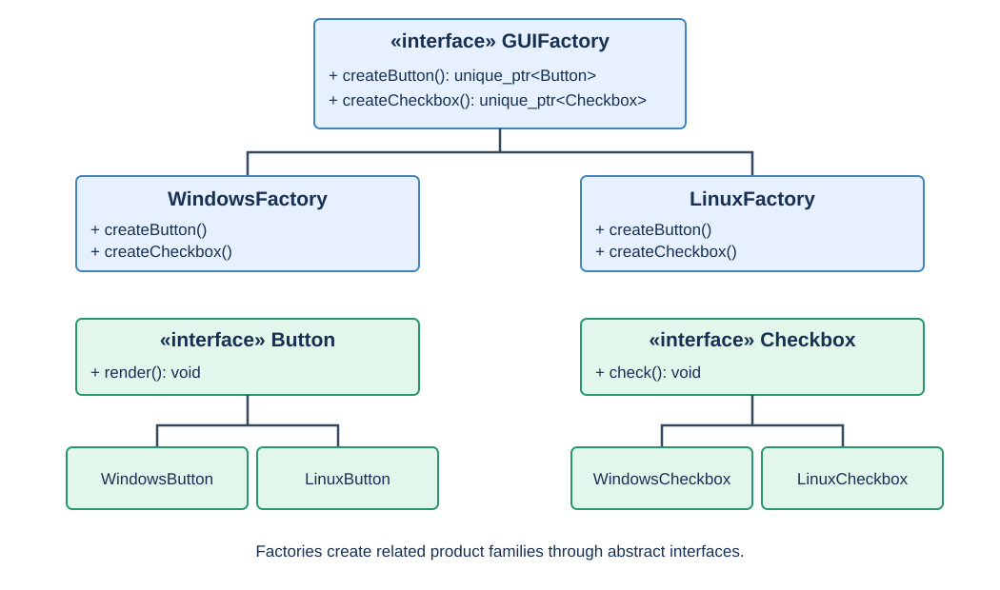
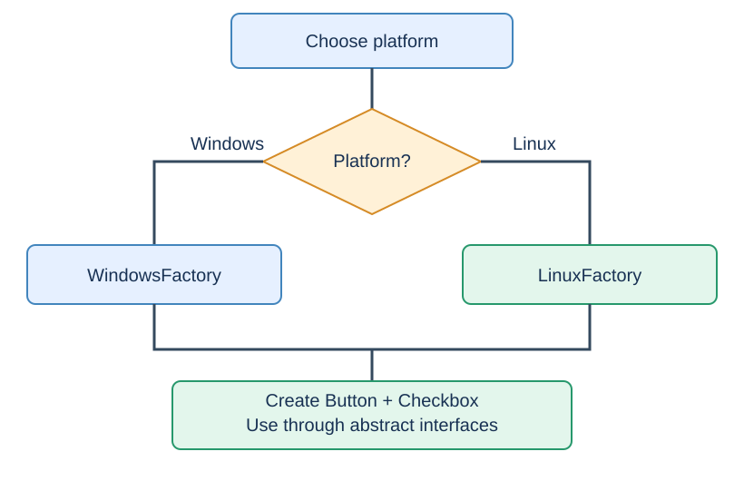

# Abstract Factory Design Pattern in C++ (C++11/14)

## 1. What is Abstract Factory?

**Abstract Factory** is a creational pattern that provides an interface for creating **families of related objects** without exposing concrete implementation classes.

**Factory vs Abstract Factory:** A simple factory selects one product (Email/SMS/Push); an abstract factory provides several related products (Button + Checkbox) for a selected family (Windows or Linux).

### Real-world example: Cross-platform UI

| Platform | Button | Checkbox |
|---|---|---|
| Windows | `WindowsButton` | `WindowsCheckbox` |
| Linux | `LinuxButton` | `LinuxCheckbox` |

A client should not need to choose concrete component classes separately.

## 2. High-Level Design (HLD)



**Flow:** Client chooses a platform-specific factory → calls `createButton()` and `createCheckbox()` → receives matching implementations through common interfaces.

## 3. UML Class Diagram



| Class | Responsibility |
|---|---|
| `Button`, `Checkbox` | Abstract product interfaces |
| `WindowsButton`, `LinuxButton` | Concrete button implementations |
| `WindowsCheckbox`, `LinuxCheckbox` | Concrete checkbox implementations |
| `GUIFactory` | Abstract factory interface |
| `WindowsFactory`, `LinuxFactory` | Concrete factories creating compatible families |
| Client | Depends only on abstract interfaces |

## 4. Complete C++11 Implementation

```cpp
#include <iostream>
#include <memory>
using namespace std;

class Button {
public:
    virtual void render() = 0;
    virtual ~Button() {}
};
class Checkbox {
public:
    virtual void check() = 0;
    virtual ~Checkbox() {}
};
class WindowsButton : public Button {
public:
    void render() override { cout << "Rendering Windows Button\n"; }
};
class WindowsCheckbox : public Checkbox {
public:
    void check() override { cout << "Windows Checkbox checked\n"; }
};
class LinuxButton : public Button {
public:
    void render() override { cout << "Rendering Linux Button\n"; }
};
class LinuxCheckbox : public Checkbox {
public:
    void check() override { cout << "Linux Checkbox checked\n"; }
};
class GUIFactory {
public:
    virtual unique_ptr<Button> createButton() = 0;
    virtual unique_ptr<Checkbox> createCheckbox() = 0;
    virtual ~GUIFactory() {}
};
class WindowsFactory : public GUIFactory {
public:
    unique_ptr<Button> createButton() override {
        return unique_ptr<Button>(new WindowsButton());
    }
    unique_ptr<Checkbox> createCheckbox() override {
        return unique_ptr<Checkbox>(new WindowsCheckbox());
    }
};
class LinuxFactory : public GUIFactory {
public:
    unique_ptr<Button> createButton() override {
        return unique_ptr<Button>(new LinuxButton());
    }
    unique_ptr<Checkbox> createCheckbox() override {
        return unique_ptr<Checkbox>(new LinuxCheckbox());
    }
};
void buildUI(GUIFactory& factory) {
    auto button = factory.createButton();
    auto checkbox = factory.createCheckbox();
    button->render();
    checkbox->check();
}
int main() {
    WindowsFactory windows;
    LinuxFactory linux;
    cout << "Windows UI:\n";
    buildUI(windows);
    cout << "\nLinux UI:\n";
    buildUI(linux);
}
```

### Output

```text
Windows UI:
Rendering Windows Button
Windows Checkbox checked

Linux UI:
Rendering Linux Button
Linux Checkbox checked
```

The `buildUI()` function contains no platform-specific product names; it depends on `GUIFactory`, `Button`, and `Checkbox` interfaces.

## 5. Runtime Execution Flow



1. The application chooses `WindowsFactory` or `LinuxFactory` (for example, based on platform or configuration).
2. It passes the factory through a `GUIFactory&` reference to `buildUI()`.
3. `createButton()` and `createCheckbox()` create matching concrete objects on the heap.
4. Each method returns a `unique_ptr` to an abstract product interface.
5. Virtual dispatch invokes the appropriate `render()` and `check()` methods.
6. `unique_ptr` automatically destroys the objects when they leave scope.

## 6. Why `unique_ptr` and Virtual Destructors?

The factory transfers ownership of each created object to the caller. `unique_ptr` makes ownership explicit and provides automatic cleanup. `virtual ~Button()` and `virtual ~Checkbox()` ensure correct destruction through base-class pointers.

## 7. Adding a New Platform (macOS)

Create `MacButton`, `MacCheckbox`, and `MacFactory : GUIFactory`. Implement both creation methods in `MacFactory`. **Existing client code (`buildUI`) stays unchanged.** The composition root that chooses a factory may need updating.

**Important tradeoff:** Adding a *new product family* (macOS) is straightforward. Adding a *new product kind* (e.g., Slider) requires adding `createSlider()` to `GUIFactory` and implementing it in every concrete factory. This is the central Abstract Factory tradeoff.

## 8. Practical Use Cases

- **Cross-platform GUI:** Matching widgets for Windows, Linux, and macOS.
- **Database integrations:** A family of connections, commands, and transactions for MySQL vs PostgreSQL.
- **Cloud providers:** Related storage, queue, and identity adapters for AWS vs Azure.
- **Operating system abstractions:** Matching file watcher and event loop components for Linux vs Windows.
- **Testing:** Substitute a `MockFactory` that creates mock implementations of all dependent services.

## 9. Abstract Factory vs Factory vs Strategy vs Singleton

| Pattern | Primary purpose | Example |
|---|---|---|
| Singleton | Ensure one shared instance | Configuration manager |
| Simple Factory | Centralize creation of one product | Email/SMS/Push |
| Abstract Factory | Create compatible product families | Windows Button + Checkbox |
| Strategy | Switch behavior/algorithm | Different notification delivery algorithms |

**Abstract Factory vs Factory Method:** Factory Method lets subclasses override a creation method for a product. Abstract Factory exposes several creation methods for a related family, often implemented using factory methods.

## 10. Interview Questions

**Q1. Why use Abstract Factory?** To create compatible families of related objects while keeping client code independent of concrete classes.

**Q2. How is it different from Simple Factory?** A Simple Factory typically chooses one product implementation; Abstract Factory offers several related product interfaces and concrete factories for entire families.

**Q3. Is it Open/Closed?** Adding a new family generally needs new classes, not changes to existing clients. Adding a new *product type* requires changing the factory interface and all factories.

**Q4. Why is the destructor virtual?** To safely destroy derived products through `unique_ptr<Base>`.

**Q5. Is it thread-safe?** The stateless factory methods shown can be called concurrently if their constructors and dependencies are safe; shared mutable factory state needs synchronization.

**Q6. What are the disadvantages?** More interfaces/classes, extra indirection, and difficulty extending the abstract factory with new product kinds.

**Q7. When should you avoid it?** When products are unrelated or only one concrete implementation exists and family consistency is not important; simpler construction or dependency injection may be sufficient.

## 11. Interview-Ready Answer (45 seconds)

> Abstract Factory is a creational design pattern for creating families of related objects without coupling the client to concrete classes. For example, a cross-platform C++ UI can define abstract Button and Checkbox interfaces, and WindowsFactory and LinuxFactory create the matching implementations. The client receives these objects via unique_ptr to their base interfaces and uses virtual dispatch. This makes adding a new platform family easier and keeps related products consistent. The main tradeoff is that adding a new product type requires modifying the abstract factory interface and every concrete factory.

**Key takeaway:** **Factory creates a product; Abstract Factory creates a compatible family of products.**
