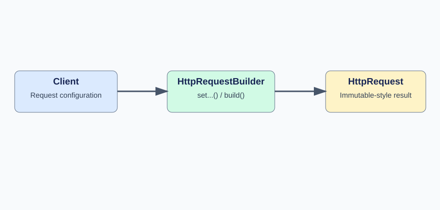
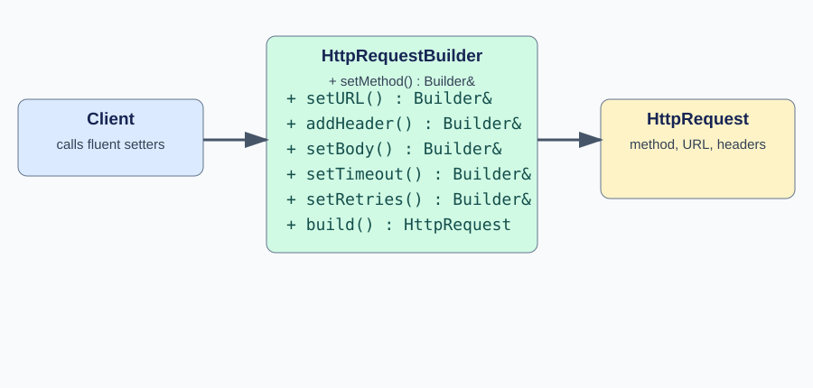
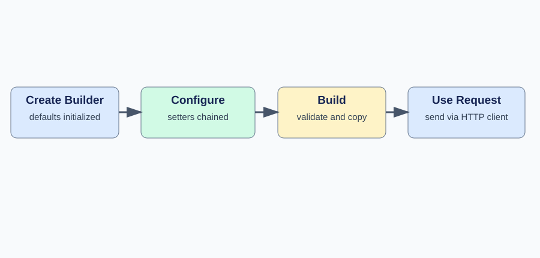

# Builder Design Pattern in C++11/14

A complete, GitHub-ready guide with standalone SVG diagrams and runnable C++11 code.

## 1. What is Builder?

**Builder** is a creational design pattern that constructs a complex object **step by step**. It avoids long, difficult-to-read constructors and makes optional configuration explicit.

### Practical example: HTTP Request

An HTTP request may need a method, URL, headers, body, timeout, and retry policy. Compare:

```cpp
HttpRequest request("POST", "/api/users", headers, body, 5000, 3);
```

with:

```cpp
HttpRequest request = HttpRequestBuilder()
    .setMethod("POST")
    .setURL("/api/users")
    .addHeader("Content-Type", "application/json")
    .setBody(R"({"name":"Gaurav"})")
    .setTimeout(5000)
    .setRetries(3)
    .build();
```

The second version makes the meaning of each option obvious.

## 2. High-Level Design (HLD)



**Flow:** Client creates a builder → configures it → calls `build()` → receives a completed `HttpRequest`.

## 3. UML Class Diagram



| Class | Responsibility |
|---|---|
| `HttpRequest` | Finished product containing request fields and a read-only display operation |
| `HttpRequestBuilder` | Holds construction state, exposes fluent setters, validates and builds |
| Client | Chooses configuration and uses the completed request |

The example is a **fluent builder**: setters return `HttpRequestBuilder&` so calls can be chained. A classic GoF Builder may also have a `Director` and separate concrete builders; neither is necessary for this example.

## 4. Complete C++11 Implementation

The code below is also available as [`builder.cpp`](builder.cpp).

```cpp
#include <iostream>
#include <map>
#include <stdexcept>
#include <string>
#include <utility>
using namespace std;

class HttpRequest {
    string method_, url_, body_;
    map<string, string> headers_;
    int timeoutMs_, retries_;
public:
    HttpRequest(string method, string url, map<string,string> headers,
                string body, int timeoutMs, int retries)
        : method_(std::move(method)), url_(std::move(url)),
          body_(std::move(body)), headers_(std::move(headers)),
          timeoutMs_(timeoutMs), retries_(retries) {}

    void print() const {
        cout << method_ << " " << url_ << "\n";
        for (const auto& h : headers_)
            cout << h.first << ": " << h.second << "\n";
        cout << "Body: " << body_ << "\nTimeout: " << timeoutMs_
             << " ms\nRetries: " << retries_ << "\n";
    }
};

class HttpRequestBuilder {
    string method_ = "GET", url_, body_;
    map<string,string> headers_;
    int timeoutMs_ = 3000, retries_ = 0;
public:
    HttpRequestBuilder& setMethod(const string& value) {
        method_ = value; return *this;
    }
    HttpRequestBuilder& setURL(const string& value) {
        url_ = value; return *this;
    }
    HttpRequestBuilder& addHeader(const string& key, const string& value) {
        headers_[key] = value; return *this;
    }
    HttpRequestBuilder& setBody(const string& value) {
        body_ = value; return *this;
    }
    HttpRequestBuilder& setTimeout(int ms) {
        if (ms <= 0) throw invalid_argument("timeout must be positive");
        timeoutMs_ = ms; return *this;
    }
    HttpRequestBuilder& setRetries(int count) {
        if (count < 0) throw invalid_argument("retries cannot be negative");
        retries_ = count; return *this;
    }
    HttpRequest build() const {
        if (url_.empty()) throw invalid_argument("URL is required");
        if (method_.empty()) throw invalid_argument("method is required");
        return HttpRequest(method_, url_, headers_, body_, timeoutMs_, retries_);
    }
};

int main() {
    HttpRequest request = HttpRequestBuilder()
        .setMethod("POST")
        .setURL("/api/users")
        .addHeader("Content-Type", "application/json")
        .setBody(R"({"name":"Gaurav"})")
        .setTimeout(5000)
        .setRetries(3)
        .build();
    request.print();
}
```

Compile and run:

```bash
g++ -std=c++11 -Wall -Wextra -pedantic builder.cpp -o builder
./builder
```

Expected output:

```text
POST /api/users
Content-Type: application/json
Body: {"name":"Gaurav"}
Timeout: 5000 ms
Retries: 3
```

This example **constructs and prints** an HTTP request; it does not perform a network operation.

## 5. Internal Execution Flow



1. Construct a `HttpRequestBuilder` with default method `GET`, timeout `3000 ms`, and zero retries.
2. Each setter updates builder state and returns `*this`, enabling chaining.
3. `build()` checks required fields (method and URL).
4. `build()` returns a distinct `HttpRequest` value with copied configuration.
5. The client uses the completed request; further changes to the builder do not modify that request.

### Why `return *this`?

```cpp
HttpRequestBuilder& setTimeout(int ms) {
    timeoutMs_ = ms;
    return *this;
}
```

`*this` refers to the current builder object. Returning it by reference enables `.setTimeout(5000).setRetries(3)` without constructing new builders at each step.

### Ownership and memory

No raw `new` or `delete` is required. The builder and returned request are ordinary value objects. The request stores its own strings and map; it does not borrow the builder's fields.

### Validation

The builder rejects empty URLs, nonpositive timeouts, and negative retry counts. More complete production validation would include supported HTTP methods, URL syntax, header constraints, and a coherent retry policy.

## 6. Why not a large constructor?

| Large constructor | Builder |
|---|---|
| Hard to remember parameter order | Self-documenting method names |
| Many overloads for optional values | Defaults plus optional setters |
| Validity often checked in constructor | Validate once in `build()` |
| Compact for small objects | More code but clearer for complex objects |

For objects with only two or three required fields, a regular constructor is often simpler.

## 7. Practical Use Cases

**HTTP/gRPC request configuration:** Set endpoints, headers, deadlines, retries and credentials before sending.

**Database connection configuration:** Set host, port, TLS options, connection limits and timeouts.

**Cloud infrastructure configuration:** Assemble Kubernetes deployment specs or storage client settings from many optional parameters.

**Embedded systems:** Configure a device session with bus, address, timeout, retry policy and logging settings.

**Test fixtures:** Build complicated test objects with sensible defaults, overriding only the fields needed for each test.

## 8. Extending the Example

Add a field such as `bool followRedirects_ = false` to the builder and the request, and expose a setter:

```cpp
HttpRequestBuilder& setFollowRedirects(bool enabled) {
    followRedirects_ = enabled;
    return *this;
}
```

Then pass it to the request during `build()`. Existing client calls can remain unchanged because the new option has a default. The example above does not include this extension in the runnable source.

## 9. Builder vs Factory vs Abstract Factory vs Singleton

| Pattern | Main goal | Example |
|---|---|---|
| Builder | Assemble one complex object in stages | Configurable HTTP request |
| Simple Factory | Choose a concrete implementation | Email/SMS/Push notification |
| Abstract Factory | Create a related family of objects | Windows/Linux buttons and checkboxes |
| Singleton | Restrict construction to one instance | Shared logger |

**Important:** Builder does not inherently create immutable objects. Immutability depends on the product's API. Here the product exposes no public setters, but the demonstration does not enforce deep immutability.

## 10. Principal Engineer Interview Questions

**Q1. Is Builder a creational pattern?** Yes. It controls the construction process of a complex object.

**Q2. What is a fluent interface?** Methods return an object or reference that allows method chaining. Builders commonly use fluent interfaces, but the concepts are not identical.

**Q3. Is Builder thread-safe?** Not automatically. Sharing a mutable builder between threads requires synchronization. Independently created builders are straightforward to use concurrently.

**Q4. Can a Builder be reused?** Yes, if its API permits. In this example, `build()` is `const` and does not reset builder state. Reusing a builder retains prior configuration, so be careful about stale fields.

**Q5. What is a Director?** In the classic GoF Builder pattern, a Director coordinates a prescribed sequence of build steps. Fluent builders often omit it.

**Q6. Why validate in `build()`?** It provides a single point to enforce cross-field constraints and prevent producing incomplete requests.

**Q7. What are disadvantages?** Additional classes and boilerplate; mutable builders may be reused accidentally; simple objects rarely need them.

**Q8. When should you avoid Builder?** When an object has only a few mandatory fields and no complex construction rules.

## 11. Interview-Ready Answer (45 seconds)

> Builder is a creational design pattern that constructs complex objects step by step. It is useful when an object has many optional parameters or requires validation before use. For example, an HTTP request builder can configure the method, URL, headers, body, timeout and retry policy through fluent setters, then return a completed request using `build()`. In C++11, I can implement it with value semantics, return `Builder&` from setters, and validate the configuration in `build()`. Compared with Factory, Builder focuses on how an object is assembled rather than selecting which concrete class to instantiate.

**Key takeaway:** **Fluent setters + defaults + validation in `build()` + completed product**.
