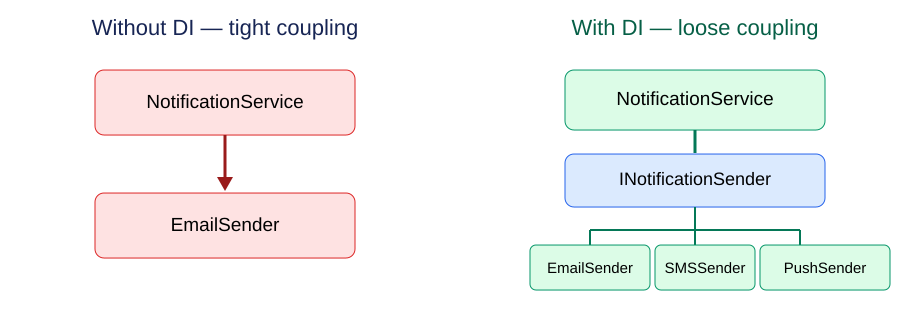
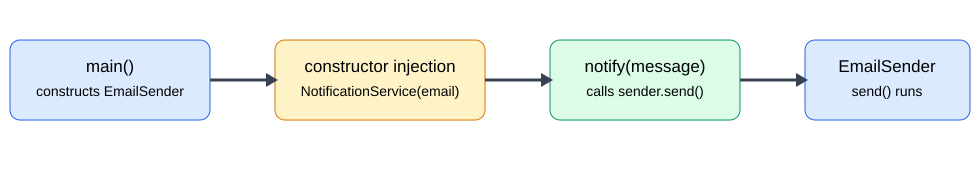
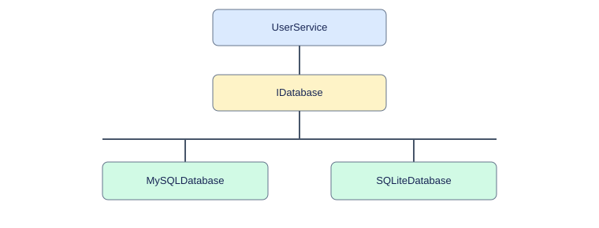
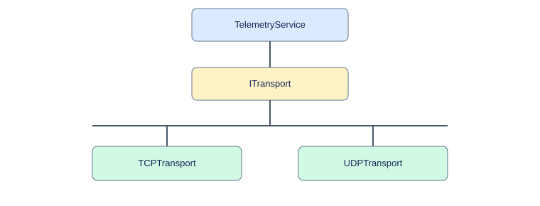
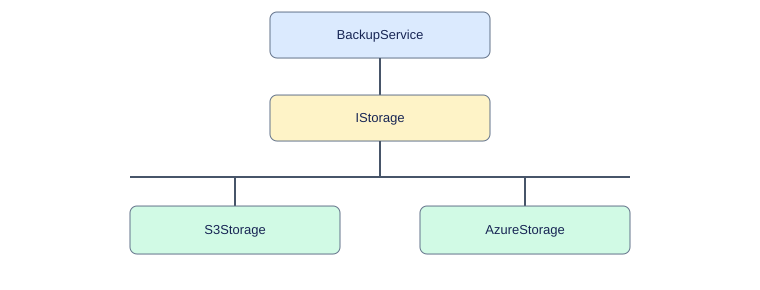
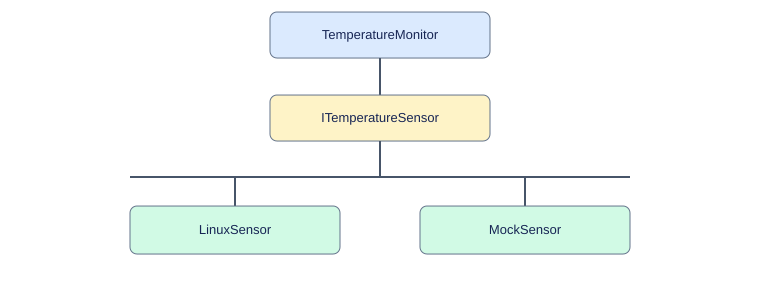
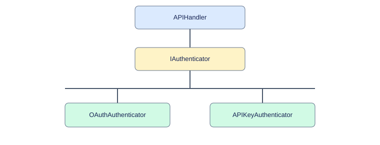
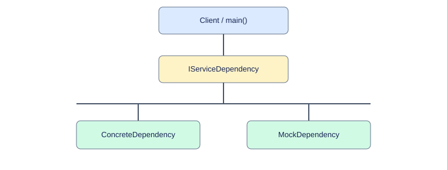
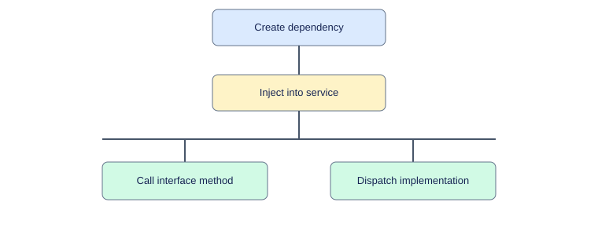

# Dependency Injection in C++11/14 — Fundamentals and Real-World Examples

> **Core idea:** A class should receive the dependencies it needs from outside instead of hard-coding their construction internally. Dependency Injection (DI) is a design technique, not a GoF creational pattern.

# Part I — Understanding Dependency Injection

## 1. What is Dependency Injection?

A **dependency** is another object or service that a class needs to perform its work. **Dependency Injection** means that the caller (or composition root) constructs that dependency and supplies it to the class, typically through a constructor, setter, or method parameter.

For example, `NotificationService` needs a sender. Instead of constructing an `EmailSender` internally, it receives an `INotificationSender` reference. The service can now work with Email, SMS, Push, or a test double without changing its code.

## 2. Why is it used?

- **Loose coupling:** Business logic depends on an interface instead of a concrete implementation.
- **Testability:** Replace real databases, hardware, network clients, or authentication providers with fakes or mocks.
- **Flexibility:** Choose different implementations for different platforms, environments, or deployments.
- **Maintainability:** Change infrastructure implementations without rewriting the service that uses them.
- **Explicit dependencies:** Constructor parameters reveal what a class requires.

DI does not automatically require interfaces or a DI framework. Supplying a concrete dependency from outside is also injection; interfaces are especially useful when implementations vary.

## 3. Before vs After DI



**Without DI — tightly coupled:**

```cpp
class NotificationService {
    EmailSender sender;  // Concrete dependency constructed as part of service
public:
    void notify(const std::string& message) { sender.send(message); }
};
```

**With DI — implementation supplied externally:**

```cpp
class INotificationSender {
public:
    virtual void send(const std::string& message) = 0;
    virtual ~INotificationSender() {}
};

class NotificationService {
    INotificationSender& sender; // Non-owning reference
public:
    explicit NotificationService(INotificationSender& s) : sender(s) {}
    void notify(const std::string& message) { sender.send(message); }
};

// Caller / composition root:
// EmailSender email;
// NotificationService service(email);
// service.notify("Welcome!");
```

**Important:** The injected sender must outlive `NotificationService` when stored as a reference. Use `std::unique_ptr` if the service should own the dependency, or `std::shared_ptr` if ownership must be shared.

## 4. How DI works at runtime



1. The application constructs a concrete dependency such as `EmailSender`.
2. It passes the dependency to `NotificationService`'s constructor.
3. `NotificationService` stores the reference and uses the interface.
4. `notify()` calls `send()`; virtual dispatch invokes the chosen implementation.
5. In a test, the application can inject a fake sender instead.

## 5. Types of Dependency Injection

| Type | How it works | Typical use |
|---|---|---|
| **Constructor injection** | Pass required dependency to constructor | Preferred for mandatory dependencies |
| **Setter injection** | Provide or replace dependency using a setter | Optional or reconfigurable dependency |
| **Method injection** | Pass dependency to a particular operation | Dependency needed for one call only |

Constructor injection makes required dependencies explicit and helps prevent partially initialized objects. Setter injection may need null/state checks. Method injection avoids storing a dependency when it is needed only temporarily.

## 6. DI vs Dependency Inversion vs Factory vs Strategy

- **Dependency Injection (DI):** How a class receives collaborators.
- **Dependency Inversion Principle (DIP):** High-level policy and low-level implementation should depend on abstractions; DI often helps achieve this.
- **Factory:** Encapsulates how concrete objects are created; a factory may be used by the composition root to create dependencies.
- **Strategy:** Encapsulates interchangeable behaviors; a strategy object can be injected through DI.

**When not to use DI:** Avoid introducing elaborate interfaces or containers for trivial objects with no meaningful variation. Prefer the simplest design that supports testing and expected change.

---

# Part II — Real-World C++ Examples

The examples below use compact, illustrative implementations. Console output is a placeholder for real database, networking, cloud, hardware, and authentication operations.

## 1. Database Access — MySQL vs SQLite

**Problem:** `UserService` should not be tied to one database implementation.



```cpp
#include <iostream>
#include <string>
using namespace std;

class IDatabase {
public:
    virtual void save(const string& data) = 0;
    virtual ~IDatabase() {}
};
class MySQLDatabase : public IDatabase {
public:
    void save(const string& data) override { cout << "Saving to MySQL: " << data << '\n'; }
};
class SQLiteDatabase : public IDatabase {
public:
    void save(const string& data) override { cout << "Saving to SQLite: " << data << '\n'; }
};
class UserService {
    IDatabase& db;
public:
    explicit UserService(IDatabase& database) : db(database) {}
    void saveUser(const string& name) { db.save(name); }
};
int main() {
    MySQLDatabase mysql;
    UserService service(mysql);
    service.saveUser("John");
    SQLiteDatabase sqlite;
    UserService anotherService(sqlite);
    anotherService.saveUser("John");
}
```

**Benefit:** Switch database adapters without modifying `UserService`. These implementations illustrate the architecture; they do not actually connect to a database.

## 2. Networking — TCP vs UDP Transport

A telemetry service should not create its own transport. Inject the transport interface.



```cpp
#include <iostream>
#include <string>
using namespace std;

class ITransport {
public:
    virtual void send(const string& data) = 0;
    virtual ~ITransport() {}
};
class TCPTransport : public ITransport {
public:
    void send(const string& data) override { cout << "Sending over TCP: " << data << '\n'; }
};
class UDPTransport : public ITransport {
public:
    void send(const string& data) override { cout << "Sending over UDP: " << data << '\n'; }
};
class TelemetryService {
    ITransport& transport;
public:
    explicit TelemetryService(ITransport& t) : transport(t) {}
    void publish(const string& data) { transport.send(data); }
};
int main() {
    TCPTransport tcp;
    TelemetryService service(tcp);
    service.publish("CPU Usage: 80%");
}
```

**Benefit:** Swap transports or inject a fake for testing. **Production caveat:** TCP is a reliable byte stream; UDP sends datagrams without guaranteed delivery. A real interface should account for these different semantics, partial writes, failures, and backpressure. The sample only prints messages.

## 3. Cloud Storage — AWS S3 vs Azure Blob

A backup service should not hard-code one cloud provider.



```cpp
#include <iostream>
#include <string>
using namespace std;

class IStorage {
public:
    virtual void upload(const string& file) = 0;
    virtual ~IStorage() {}
};
class S3Storage : public IStorage {
public:
    void upload(const string& file) override { cout << "Uploading to AWS S3: " << file << '\n'; }
};
class AzureStorage : public IStorage {
public:
    void upload(const string& file) override { cout << "Uploading to Azure Blob: " << file << '\n'; }
};
class BackupService {
    IStorage& storage;
public:
    explicit BackupService(IStorage& s) : storage(s) {}
    void backup(const string& file) { storage.upload(file); }
};
int main() {
    S3Storage s3;
    BackupService backup(s3);
    backup.backup("database.zip");
    AzureStorage azure;
    BackupService azureBackup(azure);
    azureBackup.backup("database.zip");
}
```

**Benefit:** Cloud-provider independence and easier integration tests. Real adapters would use the providers' SDKs and handle credentials, retries, errors and multipart uploads.

## 4. Embedded Linux — Hardware Abstraction

A monitoring daemon should read temperature through a sensor interface so tests can simulate overheating without hardware.



```cpp
#include <iostream>
using namespace std;

class ITemperatureSensor {
public:
    virtual int readTemperature() = 0;
    virtual ~ITemperatureSensor() {}
};
class LinuxSensor : public ITemperatureSensor {
public:
    int readTemperature() override {
        // Real implementation could read /sys/class/thermal/...
        return 65;
    }
};
class MockSensor : public ITemperatureSensor {
public:
    int readTemperature() override { return 95; }
};
class TemperatureMonitor {
    ITemperatureSensor& sensor;
public:
    explicit TemperatureMonitor(ITemperatureSensor& s) : sensor(s) {}
    void check() {
        if (sensor.readTemperature() > 85) cout << "Temperature Alert!\n";
    }
};
int main() {
    LinuxSensor realSensor;
    TemperatureMonitor production(realSensor);
    production.check();
    MockSensor fakeSensor;
    TemperatureMonitor test(fakeSensor);
    test.check();
}
```

**Benefit:** Hardware-independent unit testing, deterministic alerts, and support for different boards. The `LinuxSensor` above is a stub rather than a real sysfs reader.

## 5. Authentication — OAuth vs API Key

An API handler should depend on an authentication contract, not on one concrete authentication provider.



```cpp
#include <iostream>
#include <string>
using namespace std;

class IAuthenticator {
public:
    virtual bool authenticate(const string& credential) = 0;
    virtual ~IAuthenticator() {}
};
class OAuthAuthenticator : public IAuthenticator {
public:
    bool authenticate(const string& token) override {
        // Demo only; NOT secure OAuth validation.
        return !token.empty();
    }
};
class APIKeyAuthenticator : public IAuthenticator {
public:
    bool authenticate(const string& key) override {
        // Demo only; NOT secure API-key validation.
        return !key.empty();
    }
};
class APIHandler {
    IAuthenticator& auth;
public:
    explicit APIHandler(IAuthenticator& a) : auth(a) {}
    void handle(const string& credential) {
        if (auth.authenticate(credential)) cout << "Request accepted\n";
        else cout << "Unauthorized\n";
    }
};
int main() {
    OAuthAuthenticator oauth;
    APIHandler handler(oauth);
    handler.handle("demo-token");
}
```

**Benefit:** Separate authentication mechanism from request handling. **Security:** Never use `!credential.empty()` in production. OAuth requires appropriate token validation (signature, issuer, audience, expiration and applicable claims); API keys require secure verification and authorization.

## 6. Comparison: Which Examples Matter Most?

| Use case | Injected interface | Practical benefit |
|---|---|---|
| Database | `IDatabase` | Database-provider independence |
| Networking | `ITransport` | Alternate transports and test doubles |
| Cloud storage | `IStorage` | Multi-cloud flexibility |
| Embedded hardware | `ITemperatureSensor` | Test without physical hardware |
| Authentication | `IAuthenticator` | Pluggable security implementations |
| Logging | `ILogger` | Swap outputs and capture logs in tests |

## 7. UML: General Constructor Injection



**Execution flow:**



1. The application creates a concrete dependency.
2. It passes that object to the service constructor.
3. The service stores a reference to the abstract interface.
4. Business logic calls the interface method.
5. Virtual dispatch invokes the selected implementation.

### Ownership and lifetime

In these C++11 examples, services hold **non-owning references**. The injected object must outlive the service. For owned dependencies, consider `std::unique_ptr<Interface>`; use `std::shared_ptr` only for genuinely shared ownership.

### Dependency Injection vs Strategy

- **DI** describes *how a class receives dependencies*.
- **Strategy** describes *how interchangeable behaviors are modeled*.
- Both may use the same interfaces and constructor arguments.

## 8. Principal Engineer Interview Answer

> I use Dependency Injection to decouple business logic from infrastructure. For example, a C++ telemetry service can depend on an `ITransport` interface instead of constructing a TCP client internally. At startup, the application injects a TCP implementation; in unit tests, it injects a fake transport. This keeps the service unchanged, improves testability, and follows the Dependency Inversion Principle. In C++, I use references for non-owning dependencies and smart pointers when ownership must be explicit.

## 9. Build and Run

Every code sample is a self-contained C++11 program. Save one block as `example.cpp` and run:

```bash
g++ -std=c++11 -Wall -Wextra -pedantic example.cpp -o example
./example
```

**Interview takeaway:** The key is not merely using an interface. The caller must create and supply the dependency, and the receiving class must avoid constructing the concrete dependency internally.
