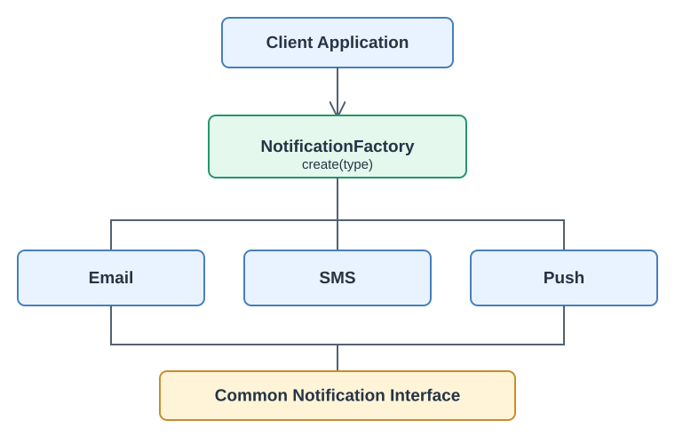
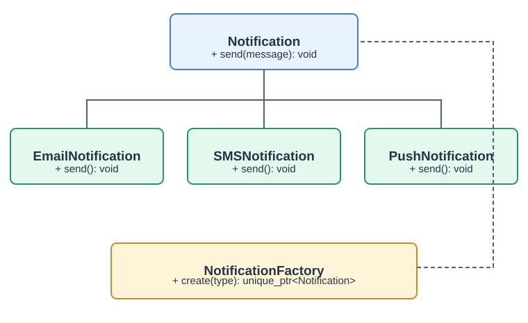
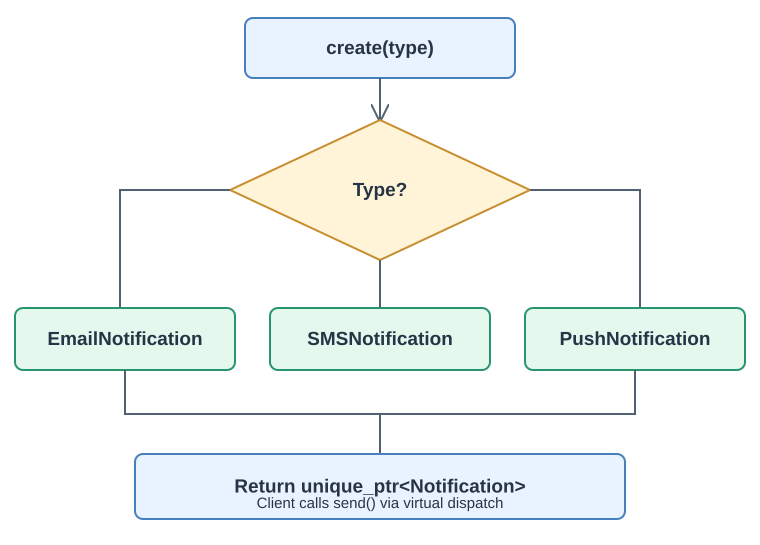

# Factory Design Pattern in C++ (C++11/14)

A complete interview guide using a **Notification System** (Email, SMS, Push), with UML, flow diagrams and compilable C++11 code.

## 1. What is Factory?

The **Factory Pattern** centralizes object creation. The client requests an object by type, receives a common interface, and does not need to construct concrete classes itself.

**Without Factory:**

```cpp
if (type == "EMAIL") notification = new EmailNotification();
else if (type == "SMS") notification = new SMSNotification();
else if (type == "PUSH") notification = new PushNotification();
```

**With Factory:**

```cpp
auto notification = NotificationFactory::create("EMAIL");
notification->send("Hello World");
```

## 2. High-Level Design (HLD)



**Flow:** Client requests a type → Factory creates a concrete notification → Client calls `send()` via the common interface.

## 3. UML Class Diagram



| Class | Responsibility |
|---|---|
| `Notification` | Abstract interface declaring `send()` |
| `EmailNotification` | Email implementation |
| `SMSNotification` | SMS implementation |
| `PushNotification` | Push implementation |
| `NotificationFactory` | Creates a concrete implementation based on type |
| Client | Uses the common interface |

## 4. Complete C++11 Implementation

```cpp
#include <iostream>
#include <memory>
#include <string>
#include <stdexcept>
using namespace std;

// 1. Abstract interface
class Notification {
public:
    virtual void send(const string& message) = 0;
    virtual ~Notification() {}
};

// 2. Concrete implementations
class EmailNotification : public Notification {
public:
    void send(const string& message) override {
        cout << "Email sent: " << message << endl;
    }
};

class SMSNotification : public Notification {
public:
    void send(const string& message) override {
        cout << "SMS sent: " << message << endl;
    }
};

class PushNotification : public Notification {
public:
    void send(const string& message) override {
        cout << "Push sent: " << message << endl;
    }
};

// 3. Simple Factory
class NotificationFactory {
public:
    static unique_ptr<Notification> create(const string& type) {
        if (type == "EMAIL")
            return unique_ptr<Notification>(new EmailNotification());
        if (type == "SMS")
            return unique_ptr<Notification>(new SMSNotification());
        if (type == "PUSH")
            return unique_ptr<Notification>(new PushNotification());
        throw invalid_argument("Unknown notification type");
    }
};

// 4. Client
int main() {
    auto email = NotificationFactory::create("EMAIL");
    auto sms   = NotificationFactory::create("SMS");
    auto push  = NotificationFactory::create("PUSH");

    email->send("Welcome!");
    sms->send("Your OTP is 123456");
    push->send("New message received");
    return 0;
}
```

**Output:**

```text
Email sent: Welcome!
SMS sent: Your OTP is 123456
Push sent: New message received
```

> This implementation is a **Simple Factory**. The classic Gang of Four **Factory Method** pattern uses an overridable creation method on a creator hierarchy.

## 5. How It Works Internally

```cpp
auto notification = NotificationFactory::create("EMAIL");
notification->send("Hello World");
```



1. Client calls `NotificationFactory::create("EMAIL")`.
2. Factory checks the requested type.
3. Factory constructs `EmailNotification` on the heap.
4. Factory returns a `unique_ptr<Notification>` owning the object.
5. Client invokes `send()` through the base interface.
6. Virtual dispatch invokes `EmailNotification::send()`.
7. When the `unique_ptr` goes out of scope, the concrete object is destroyed.

### Why a virtual destructor?

```cpp
virtual ~Notification() {}
```

It ensures derived-class destruction is correct when deleting through a `Notification*` base pointer.

## 6. Why `unique_ptr` Instead of Raw Pointers?

**Raw pointer ownership is manual:**

```cpp
Notification* n = new EmailNotification();
n->send("Hello");
delete n; // Easy to forget on errors or early returns
```

**`unique_ptr` ownership is automatic:**

```cpp
auto n = NotificationFactory::create("EMAIL");
n->send("Hello"); // Automatically destroyed at scope exit
```

`unique_ptr` communicates single ownership, prevents leaks during exceptions, and eliminates manual `delete`.

## 7. Extending With WhatsApp

Add another implementation:

```cpp
class WhatsAppNotification : public Notification {
public:
    void send(const string& message) override {
        cout << "WhatsApp sent: " << message << endl;
    }
};
```

Add a branch in `NotificationFactory::create()`:

```cpp
if (type == "WHATSAPP")
    return unique_ptr<Notification>(new WhatsAppNotification());
```

Then the client can use:

```cpp
auto n = NotificationFactory::create("WHATSAPP");
n->send("Hello from WhatsApp!");
```

**Design nuance:** Existing concrete implementations do not change, but the Simple Factory *does* need modification. A registration-based factory or Factory Method can reduce that coupling.

## 8. Practical Use Cases

1. **Notification services:** Email, SMS, Push, WhatsApp providers.
2. **Database drivers:** MySQL, PostgreSQL, SQLite implementations behind one interface.
3. **OS abstraction:** Linux and Windows file watchers, event pollers, or network components.
4. **Cloud storage:** AWS S3, Azure Blob, local filesystem providers.

## 9. Factory vs Singleton

| Feature | Singleton | Factory |
|---|---|---|
| Purpose | Limit instances | Encapsulate creation |
| Object count | Usually one per process | Can create many |
| Main method | `getInstance()` | `create()` |
| Inheritance | Not required | Often uses polymorphism |
| Example | Shared logger | Notification creation |
| Ownership | Usually internally managed | Often transferred to caller |

A Factory can itself be a Singleton, but that is usually unnecessary.

## 10. Interview Questions

**Q1. Why use Factory?** Centralizes object construction, reduces client dependence on concrete classes, and makes implementation selection configurable.

**Q2. Which principles does it support?** Encapsulation of creation and dependency inversion. Depending on design, it may support the Open/Closed Principle; a Simple Factory with an `if` chain must still be edited for new types.

**Q3. Is Factory thread-safe?** A stateless factory creating independent objects is generally safe if constructors and dependencies are thread-safe. Shared mutable factory state requires synchronization.

**Q4. Simple Factory vs Factory Method vs Abstract Factory?** Simple Factory selects a product in one creator function; Factory Method uses subclass-overridable creation; Abstract Factory creates families of related products.

**Q5. Disadvantages?** Extra abstraction and classes; a large central conditional may become difficult to maintain.

## 11. Interview-Ready Answer (45 Seconds)

> Factory is a creational pattern that encapsulates object creation. Instead of instantiating concrete classes directly, the client asks a factory for an object and uses it through a common interface. In a notification system, I would define a `Notification` interface with `send()` and concrete Email, SMS, and Push implementations. A `NotificationFactory` selects the implementation and returns `unique_ptr<Notification>` for clear ownership and automatic cleanup. This reduces coupling and centralizes construction. For larger systems, I would consider a registration-based factory or Factory Method to avoid changing a central conditional for each new implementation.

**Key takeaway:** Factory separates **what the client needs** from **how the concrete object is constructed**.
