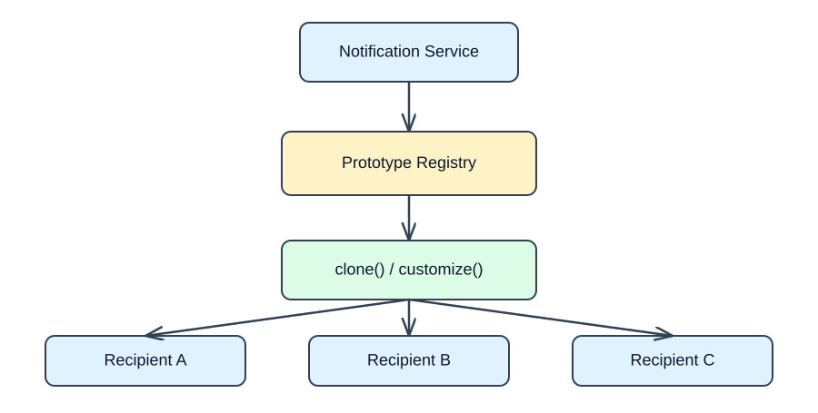
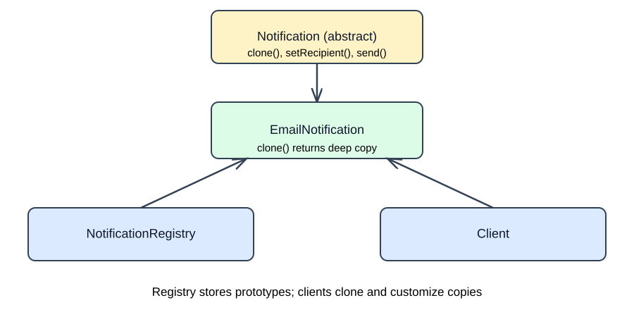
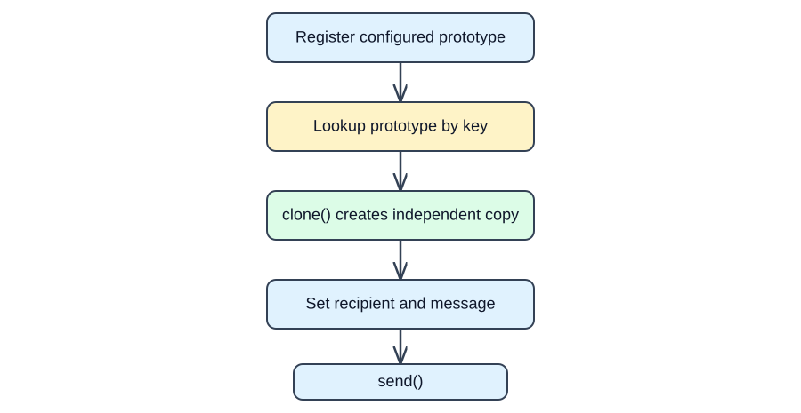

# Prototype Design Pattern in C++11/14

A GitHub-ready interview study guide using a **Notification Template System**.

## 1. What is Prototype?

Prototype is a **creational design pattern** that creates new objects by **cloning a configured existing object** rather than reconstructing it from scratch. It is useful when setup is expensive or when many objects share a baseline configuration but require independent customization.

**Example:** Preconfigure a welcome email with a sender, retry count and signature. Clone it for each recipient and personalize the clone.

```cpp
auto notification = registry.create("welcome"); // clones stored prototype
notification->setRecipient("alice@example.com");
notification->setMessage("Welcome, Alice!");
notification->send();
```

## 2. High-Level Design (HLD)



1. Configure a reusable notification template.
2. Store it in a registry by name.
3. Client requests a copy; registry invokes virtual `clone()`.
4. Client customizes the new instance and sends it.
5. Other clones and the stored prototype remain unaffected.

## 3. UML Class Diagram



| Class | Responsibility |
|---|---|
| `Notification` | Abstract product interface with virtual `clone()`, `send()` and setters |
| `EmailNotification` | Concrete prototype; implements cloning and email behavior |
| `NotificationRegistry` | Owns configured prototypes and returns cloned instances |
| Client | Requests a clone and personalizes it |

The UML emphasizes *interface inheritance* (`EmailNotification` implements `Notification`) and *ownership* (registry owns templates, client owns its clone). `clone()` is virtual so the concrete type determines how it is copied.

## 4. Complete C++11 Implementation

The following code is also included in [`prototype.cpp`](prototype.cpp).

```cpp
#include <iostream>
#include <map>
#include <memory>
#include <stdexcept>
#include <string>
using namespace std;

class Notification {
public:
    virtual ~Notification() {}
    virtual unique_ptr<Notification> clone() const = 0;
    virtual void setRecipient(const string& recipient) = 0;
    virtual void setMessage(const string& message) = 0;
    virtual void send() const = 0;
};

class EmailNotification : public Notification {
    string sender_, recipient_, message_;
    int retries_;
    unique_ptr<string> signature_; // owned resource: requires deep copy
public:
    EmailNotification(const string& sender, int retries, const string& signature)
        : sender_(sender), retries_(retries), signature_(new string(signature)) {}

    EmailNotification(const EmailNotification& other)
        : sender_(other.sender_), recipient_(other.recipient_),
          message_(other.message_), retries_(other.retries_),
          signature_(new string(*other.signature_)) {}

    unique_ptr<Notification> clone() const override {
        return unique_ptr<Notification>(new EmailNotification(*this));
    }
    void setRecipient(const string& recipient) override { recipient_ = recipient; }
    void setMessage(const string& message) override { message_ = message; }
    void send() const override {
        cout << "From: " << sender_ << " | To: " << recipient_
             << " | Message: " << message_ << " | Retries: " << retries_
             << " | Signature: " << *signature_ << '\n';
    }
};

class NotificationRegistry {
    map<string, unique_ptr<Notification> > prototypes_;
public:
    void registerPrototype(const string& key, unique_ptr<Notification> prototype) {
        prototypes_[key] = std::move(prototype);
    }
    unique_ptr<Notification> create(const string& key) const {
        auto it = prototypes_.find(key);
        if (it == prototypes_.end()) throw invalid_argument("Unknown prototype: " + key);
        return it->second->clone();
    }
};

int main() {
    NotificationRegistry registry;
    registry.registerPrototype("welcome", unique_ptr<Notification>(
        new EmailNotification("noreply@example.com", 3, "Support Team")));

    auto alice = registry.create("welcome");
    alice->setRecipient("alice@example.com");
    alice->setMessage("Welcome, Alice!");

    auto bob = registry.create("welcome");
    bob->setRecipient("bob@example.com");
    bob->setMessage("Welcome, Bob!");

    alice->send();
    bob->send();
}
```

**Expected output:**

```text
From: noreply@example.com | To: alice@example.com | Message: Welcome, Alice! | Retries: 3 | Signature: Support Team
From: noreply@example.com | To: bob@example.com | Message: Welcome, Bob! | Retries: 3 | Signature: Support Team
```

## 5. Execution Flow



**Internally:** `registry.create("welcome")` looks up the configured object, calls `clone()`, and returns a new `unique_ptr<Notification>`. Virtual dispatch invokes `EmailNotification::clone()`. The copy constructor duplicates the object's data, including its owned `signature_` string. Each caller then owns a distinct clone.

## 6. Why `clone()` and `unique_ptr`?

```cpp
virtual unique_ptr<Notification> clone() const = 0;
```

- **Virtual**: clone the actual concrete type through a base-class pointer.
- **`const`**: cloning does not modify the source prototype.
- **`unique_ptr`**: the caller receives exclusive ownership, with automatic cleanup.
- **Virtual destructor**: correct destruction through the base interface.

### Deep copy vs shallow copy

A **shallow copy** duplicates pointer values, potentially causing multiple objects to refer to the same owned resource. A **deep copy** duplicates the owned resource itself. In this example, `signature_` is a `unique_ptr<string>`; the explicit copy constructor allocates a new string for each clone:

```cpp
EmailNotification(const EmailNotification& other)
    : sender_(other.sender_), recipient_(other.recipient_),
      message_(other.message_), retries_(other.retries_),
      signature_(new string(*other.signature_)) {}
```

If all members were ordinary value types such as `std::string` and `int`, the compiler-generated copy constructor would usually be sufficient. Not every prototype needs a custom deep-copy implementation.

## 7. Practical Use Cases

1. **Notification templates:** clone predefined Email, SMS or Push configurations for individual recipients.
2. **Game engines:** duplicate configured enemies, sprites or scene objects.
3. **Document editors:** clone shapes, text styles and template documents.
4. **Network request templates:** clone a request baseline and customize headers or destinations.
5. **Embedded/Linux device configurations:** clone a validated configuration profile for multiple devices.

Cloning can still be expensive if the object contains large resources. Use shared immutable data where appropriate, and define ownership deliberately.

## 8. Prototype vs Other Creational Patterns

| Pattern | Primary intent | Typical operation |
|---|---|---|
| Singleton | Ensure a single shared instance | `getInstance()` |
| Simple Factory | Choose a concrete implementation | `create(type)` |
| Abstract Factory | Create related product families | `createButton()`, `createCheckbox()` |
| Builder | Assemble an object step by step | `setX().setY().build()` |
| Prototype | Copy an existing configured object | `prototype.clone()` |

**Factory + Prototype can work together:** a registry acts as a factory that constructs objects by cloning stored prototypes, rather than invoking constructors for every request.

## 9. Interview Questions

**Q1. Why use Prototype instead of a constructor?**  
When configuration is complex or expensive, or when the exact concrete class is only known at runtime. Cloning reuses a preconfigured baseline.

**Q2. Is Prototype the same as copying an object?**  
Prototype uses copying internally, but exposes a polymorphic `clone()` interface that works through an abstract base class.

**Q3. Why return `unique_ptr<Notification>`?**  
It makes ownership explicit and prevents leaks when callers forget `delete`.

**Q4. What about shallow versus deep copy?**  
If a prototype owns pointers or file/device resources, copying raw pointer values can cause aliasing or double deletion. Define proper copying semantics or prohibit cloning for noncopyable resources.

**Q5. Is Prototype thread-safe?**  
Not inherently. Concurrent cloning of an immutable prototype is generally safe if its `clone()` implementation and referenced dependencies are safe. Mutating shared templates requires synchronization.

**Q6. What are disadvantages?**  
Deep copying complicated object graphs is hard; some resources cannot be copied meaningfully; cloning may duplicate unwanted state or be expensive.

**Q7. What is the difference between Prototype and Factory?**  
A factory encapsulates *which object is produced*; Prototype encapsulates *copying an existing object*. A factory can use Prototype internally.

## 10. Interview-ready Answer (45 seconds)

> Prototype is a creational design pattern that creates objects by cloning existing configured instances. I define an abstract interface with a virtual `clone()` method and implement it in concrete classes. For example, a notification service can store a configured welcome-email prototype and clone it for each recipient. In C++11 I return `unique_ptr` for clear ownership, and I pay special attention to deep versus shallow copying of owned resources. Prototype is useful when object setup is complex or when I want to create copies without coupling client code to concrete classes.

**Key takeaway:** Prototype = **configure once → clone → customize**, while preserving independent state and correct ownership.
