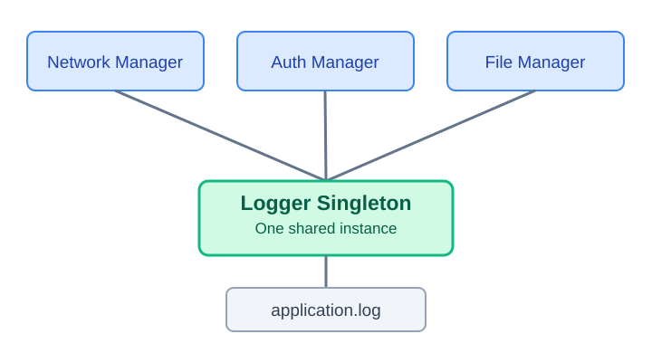
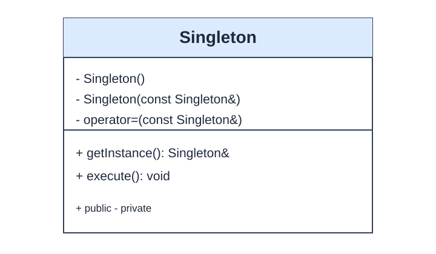
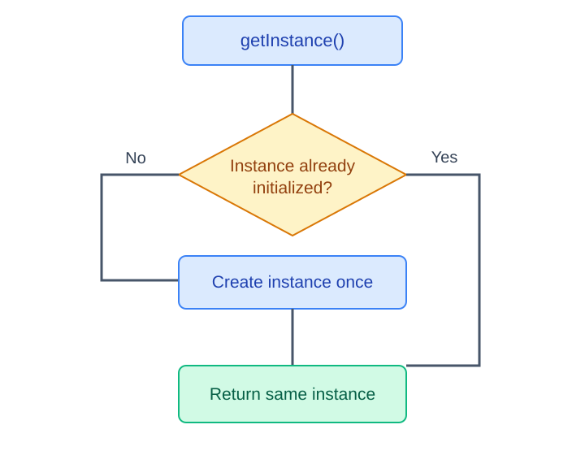

# Singleton Design Pattern in C++11/14

A practical, interview-ready guide with diagrams, implementation, examples, and common questions.

## 1. What is Singleton?

The **Singleton** is a creational design pattern that:

1. Ensures only **one instance** of a class can be created through its supported interface (within a process).
2. Provides a **global access point** to that instance.
3. Allows different modules to share the same object.

### Real-world example: Application logger

Network, Authentication, and File modules can all write through the same `Logger` instance instead of each creating a separate logger.



**Note:** A Singleton is not automatically the right design for logging; dependency injection can often make testing easier.

## 2. UML Class Diagram



| Component | Purpose |
|---|---|
| Private constructor | Prevents external direct construction |
| `getInstance()` | Returns the single shared instance |
| Deleted copy constructor | Prevents copying |
| Deleted copy assignment | Prevents assignment |
| Deleted move operations | Makes the intended non-copyable/non-movable contract explicit |
| Function-local `static` object | Constructed on first use, once |

## 3. Complete C++11 Implementation: Meyers' Singleton

Save as `singleton.cpp`:

```cpp
#include <iostream>
#include <string>
using namespace std;

class Logger {
private:
    Logger() {
        cout << "Logger created\n";
    }

public:
    Logger(const Logger&) = delete;
    Logger& operator=(const Logger&) = delete;
    Logger(Logger&&) = delete;
    Logger& operator=(Logger&&) = delete;

    static Logger& getInstance() {
        static Logger instance;
        return instance;
    }

    void log(const string& message) {
        cout << "[LOG] " << message << endl;
    }
};

int main() {
    Logger& logger1 = Logger::getInstance();
    Logger& logger2 = Logger::getInstance();

    logger1.log("Network initialized");
    logger2.log("User authenticated");

    if (&logger1 == &logger2) {
        cout << "Same instance!" << endl;
    }
}
```

Compile and run:

```bash
g++ -std=c++11 -Wall -Wextra -pedantic singleton.cpp -o singleton
./singleton
```

Expected output:

```text
Logger created
[LOG] Network initialized
[LOG] User authenticated
Same instance!
```

The constructor prints once even though `getInstance()` is called twice.

## 4. How It Works Internally

```cpp
static Logger& getInstance() {
    static Logger instance;
    return instance;
}
```



- **First call:** The function-local static `instance` is constructed and its reference returned.
- **Later calls:** The same instance is returned; construction does not repeat.
- **Multiple threads:** Since C++11, the initialization of the function-local static is thread-safe.
- **Lifetime:** The object has static storage duration and is normally destroyed during program termination if it was constructed.

**Important:** Thread-safe *initialization* does not imply that calls to methods such as `log()` are thread-safe. Synchronize shared mutable state separately.

### Thread-safe logging example

```cpp
#include <iostream>
#include <mutex>
#include <string>

class SafeLogger {
    std::mutex mutex_;
    SafeLogger() = default;

public:
    SafeLogger(const SafeLogger&) = delete;
    SafeLogger& operator=(const SafeLogger&) = delete;

    static SafeLogger& getInstance() {
        static SafeLogger instance;
        return instance;
    }

    void log(const std::string& message) {
        std::lock_guard<std::mutex> lock(mutex_);
        std::cout << "[LOG] " << message << '\n';
    }
};
```

The mutex protects concurrent calls to `log()`.

## 5. Practical Use Cases

### 5.1 Application logger

One logging service coordinates output and access to log files across modules.

### 5.2 Configuration manager

One shared configuration object supplies application settings, feature flags, and environment values.

### 5.3 Hardware resource manager

An embedded Linux application may coordinate access to a device or a shared hardware interface through one manager. Cross-process coordination still requires OS-level mechanisms.

### 5.4 Database connection pool manager

A shared manager can coordinate a **pool of multiple database connections**. Singleton applies to the manager, not to the number of connections.

### When to avoid Singleton

Prefer explicit ownership or dependency injection when components need independent instances, easy mocking, isolated tests, or clear dependencies.

## 6. Singleton vs Global Object

| Global object | Singleton |
|---|---|
| Often accessed directly | Access via `getInstance()` |
| May initialize before `main()` | Function-local static initializes on first use |
| Does not by itself prevent more instances | Constructor/copy controls can prevent more instances |
| Introduces global shared state | Also introduces global shared state, but encapsulates access |

Singleton does **not** eliminate the coupling associated with global mutable state.

## 7. Common Interview Questions

**Q1. Is Singleton thread-safe in C++11?**  
Initialization of a function-local static is thread-safe. The object's other methods must independently be thread-safe if used concurrently.

**Q2. Why is the constructor private?**  
It prevents callers from directly creating an object:

```cpp
Logger obj; // Compilation error
```

**Q3. Why delete the copy constructor?**  
To prevent creating a second object by copying:

```cpp
Logger copy = Logger::getInstance(); // Compilation error
```

**Q4. Heap or stack?**  
A function-local `static` object has **static storage duration**. It is not an ordinary stack allocation or a `new`-allocated heap object.

**Q5. What are the disadvantages?**  
Global shared state, hidden dependencies, harder mocking/testing, potential static destruction-order issues, and synchronization requirements.

**Q6. Does Singleton work across multiple processes?**  
No. Each process has its own address space and can have its own instance. Use IPC or an OS-coordinated service for cross-process sharing.

**Q7. Why return a reference instead of a pointer?**  
The instance always exists after `getInstance()` returns, so a reference is convenient and avoids a nullable result.

**Q8. What about static destruction order?**  
During shutdown, other static objects must not use the Singleton after it has been destroyed. Avoid interdependent global/static object teardown.

## 8. Interview-Ready Answer (30–45 seconds)

> Singleton is a creational design pattern that ensures only one instance of a class exists within a process and provides a global access point to it. In C++11, I prefer Meyers' Singleton using a function-local static object. Its initialization is thread-safe, and private construction plus deleted copy operations prevent additional instances. Examples include application loggers, configuration managers, and hardware resource managers. However, I avoid Singleton where dependency injection or explicit ownership offers better testability and flexibility.

## 9. Quick Revision

**Remember:** `private constructor` + `deleted copy operations` + `static local instance` + `getInstance()`.

**Critical distinction:** One-time thread-safe initialization **does not** make all methods thread-safe.

---

The images in this guide are local SVG files under `assets/`, so the Markdown renders in GitHub when the directory structure is preserved.
