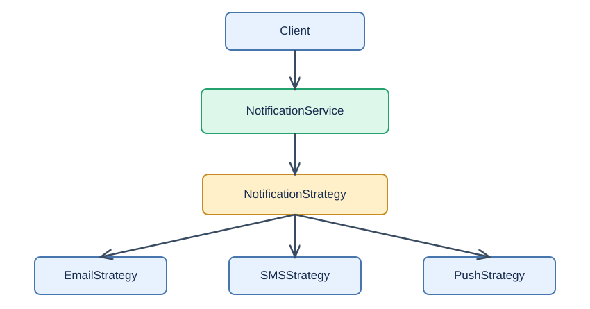
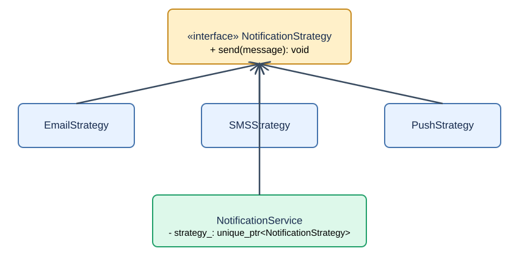
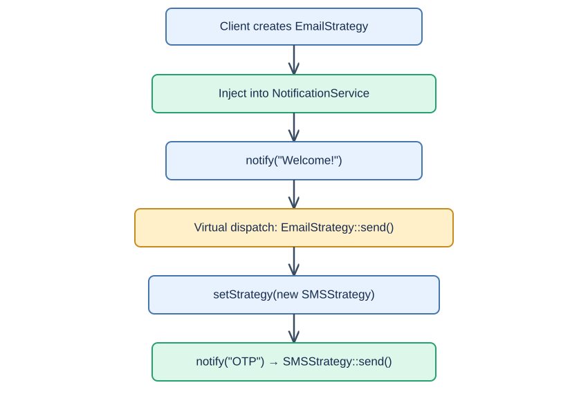

# Strategy Design Pattern in C++11/14

> Interview study guide — concept, HLD, UML, runtime flow, complete C++11 code, practical use cases, and interview questions.

## 1. What is the Strategy Design Pattern?

**Strategy** is a behavioral design pattern that defines a family of interchangeable algorithms, encapsulates each algorithm in its own class, and lets the client select or change the algorithm at runtime.

**Simple idea:** Keep *what needs to be done* separate from *how it is done*.

### Example: Notification delivery strategies

A notification service needs to send a message using **Email**, **SMS**, or **Push**. Each channel has different delivery logic, but the rest of the notification workflow is identical.

**Without Strategy:** the service embeds a growing `if/else` chain for delivery logic.

```cpp
void send(const std::string& type, const std::string& message) {
    if (type == "EMAIL") { /* email-specific delivery */ }
    else if (type == "SMS") { /* SMS-specific delivery */ }
    else if (type == "PUSH") { /* push-specific delivery */ }
}
```

**With Strategy:** each delivery method implements one interface. The service delegates the operation to its selected strategy.

```cpp
service.setStrategy(std::unique_ptr<NotificationStrategy>(new SMSStrategy()));
service.notify("Your OTP is 123456");
```

## 2. High-Level Design (HLD)



**Flow:** Client selects a strategy → injects it into `NotificationService` → service calls `send()` on the common interface → selected concrete strategy executes.

Unlike Factory, which primarily **creates objects**, Strategy primarily **changes behavior**.

## 3. UML Class Diagram



| Class | Responsibility |
|---|---|
| `NotificationStrategy` | Abstract strategy interface with `send(message)` |
| `EmailStrategy` | Email-specific delivery algorithm |
| `SMSStrategy` | SMS-specific delivery algorithm |
| `PushStrategy` | Push-specific delivery algorithm |
| `NotificationService` | Context: owns a strategy and delegates notifications |
| Client | Chooses or replaces the strategy at runtime |

The context **has a** strategy (composition); each concrete strategy **is a** `NotificationStrategy` (inheritance).

## 4. Complete C++11 Implementation

The example uses `std::unique_ptr` to make strategy ownership explicit. Delivery is simulated with `std::cout`; real integrations would call email, SMS, or push provider APIs.

```cpp
#include <iostream>
#include <memory>
#include <stdexcept>
#include <string>
#include <utility>
using namespace std;

// 1. Strategy interface
class NotificationStrategy {
public:
    virtual ~NotificationStrategy() {}
    virtual void send(const string& message) = 0;
};

// 2. Concrete strategies
class EmailStrategy : public NotificationStrategy {
public:
    void send(const string& message) override {
        cout << "Email sent: " << message << '\n';
    }
};

class SMSStrategy : public NotificationStrategy {
public:
    void send(const string& message) override {
        cout << "SMS sent: " << message << '\n';
    }
};

class PushStrategy : public NotificationStrategy {
public:
    void send(const string& message) override {
        cout << "Push sent: " << message << '\n';
    }
};

// 3. Context: delegates to its current strategy
class NotificationService {
    unique_ptr<NotificationStrategy> strategy_;

public:
    explicit NotificationService(unique_ptr<NotificationStrategy> strategy)
        : strategy_(std::move(strategy)) {
        if (!strategy_) throw invalid_argument("Strategy cannot be null");
    }

    void setStrategy(unique_ptr<NotificationStrategy> strategy) {
        if (!strategy) throw invalid_argument("Strategy cannot be null");
        strategy_ = std::move(strategy);
    }

    void notify(const string& message) {
        strategy_->send(message);
    }
};

int main() {
    NotificationService service(
        unique_ptr<NotificationStrategy>(new EmailStrategy()));

    service.notify("Welcome!");

    service.setStrategy(
        unique_ptr<NotificationStrategy>(new SMSStrategy()));
    service.notify("Your OTP is 123456");

    service.setStrategy(
        unique_ptr<NotificationStrategy>(new PushStrategy()));
    service.notify("New message received");
}
```

**Output:**

```text
Email sent: Welcome!
SMS sent: Your OTP is 123456
Push sent: New message received
```

**Compile and run:**

```bash
g++ -std=c++11 -Wall -Wextra -pedantic strategy.cpp -o strategy
./strategy
```

## 5. How Does It Work Internally?



1. Client creates an `EmailStrategy` object and passes ownership to `NotificationService`.
2. `NotificationService::notify()` invokes `strategy_->send(message)`.
3. Because `send()` is virtual, C++ dispatches the call to `EmailStrategy::send()`.
4. Client calls `setStrategy()` with `SMSStrategy`.
5. The old strategy is destroyed when the owning `unique_ptr` is replaced.
6. Subsequent `notify()` calls use `SMSStrategy::send()` without changing the context's code.

### Why use a virtual destructor?

```cpp
virtual ~NotificationStrategy() {}
```

It ensures that deleting a concrete strategy through a base pointer invokes the concrete destructor correctly.

### Why use `unique_ptr`?

`NotificationService` has **exclusive ownership** of its current strategy. The strategy is automatically destroyed when replaced or when the service is destroyed. In C++14 you can shorten construction with `std::make_unique<EmailStrategy>()`; `make_unique` is not available in C++11.

### Is this thread-safe?

**Not automatically.** Concurrent `setStrategy()` and `notify()` calls on the same context can race. Synchronize access or use immutable, per-request strategy selection in concurrent systems. The strategy's own shared mutable state also requires protection.

## 6. Add a New Strategy: WhatsApp

```cpp
class WhatsAppStrategy : public NotificationStrategy {
public:
    void send(const std::string& message) override {
        std::cout << "WhatsApp sent: " << message << '\n';
    }
};

// Then switch at runtime:
service.setStrategy(
    std::unique_ptr<NotificationStrategy>(new WhatsAppStrategy()));
service.notify("Hello from WhatsApp!");
```

No changes to `NotificationService` or existing strategies are required. This is a strong example of the **Open/Closed Principle**: extend behavior by adding classes instead of editing the context.

## 7. Practical Use Cases

1. **Notification delivery:** Email, SMS, Push, WhatsApp; choose according to user preferences or fallback rules.
2. **Compression:** ZIP, GZIP, or no compression depending on payload and latency requirements.
3. **Routing / load balancing:** Round Robin, Least Connections, or Weighted selection policies.
4. **Authentication:** Different token-validation or credential-checking policies behind one interface (subject to security review).
5. **Payment processing:** Card, UPI, or wallet-specific payment execution.
6. **Retry policies:** Fixed delay, exponential backoff, or no retry; useful in distributed systems.

**Principal Engineer design note:** Strategy is especially useful when the algorithm varies independently of the workflow, when runtime selection is needed, and when strategies should be unit-tested separately.

## 8. Strategy vs Factory vs Singleton

| Aspect | Strategy | Factory | Singleton |
|---|---|---|---|
| Category | Behavioral | Creational | Creational |
| Main goal | Swap algorithms/behavior | Encapsulate creation | Limit instance count |
| Key operation | `setStrategy()` / delegate | `create()` | `getInstance()` |
| Example | Choose Email vs SMS delivery | Construct an Email/SMS object | Shared logger instance |
| Runtime switching | Core feature | Not its primary purpose | Not its purpose |

**Can Factory and Strategy work together?** Yes. A Factory can create the chosen concrete strategy, then inject it into the context. Factory answers **which object to create**; Strategy answers **which behavior to execute**.

## 9. Common Interview Questions

**Q1. Why not just use `if/else`?**

A small fixed conditional is sometimes simpler. Strategy becomes valuable when algorithms grow, need independent testing, change frequently, or must be selected at runtime.

**Q2. Strategy vs State pattern?**

Both use composition and polymorphism. Strategy selects an interchangeable algorithm; State models behavior that changes as an object's internal state transitions, often with state-controlled transitions.

**Q3. Does Strategy follow SOLID principles?**

It supports Single Responsibility (each algorithm lives in its own class), Open/Closed (add a new strategy without changing context), and Dependency Inversion (context depends on an abstraction).

**Q4. How is ownership managed?**

This implementation uses `unique_ptr` for exclusive ownership. Shared immutable strategies could instead use `shared_ptr<const Strategy>` when multiple contexts intentionally share the same instance.

**Q5. What about performance?**

Virtual dispatch adds a small indirection, typically negligible compared with network I/O. For extremely hot paths, templates or compile-time policies may be preferable.

**Q6. Can strategies hold state?**

Yes, such as API credentials, retry counters, or compression configuration. Decide whether each context gets its own instance and ensure thread safety if state is shared.

**Q7. What are the disadvantages?**

More classes, an extra layer of indirection, and a client that must know which strategy to select. Avoid the pattern for trivial, stable behavior.

## 10. Interview-Ready Answer (45 Seconds)

> Strategy is a behavioral design pattern that encapsulates interchangeable algorithms behind a common interface, so the client can change behavior at runtime without changing the main workflow. For example, a notification service can have Email, SMS, and Push strategies, all implementing `send()`. The service owns a `NotificationStrategy` pointer and delegates sending to it. In C++11, I would typically manage the selected strategy using `unique_ptr` and a virtual destructor. This improves separation of concerns, testing, and extensibility. Unlike Factory, which is about object creation, Strategy is about choosing behavior.

**Key takeaway:** **Interface + concrete strategies + context that delegates + runtime strategy selection.**
