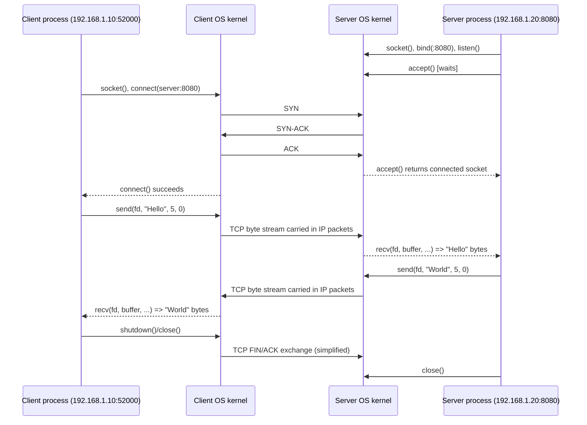
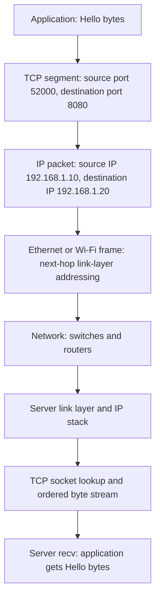
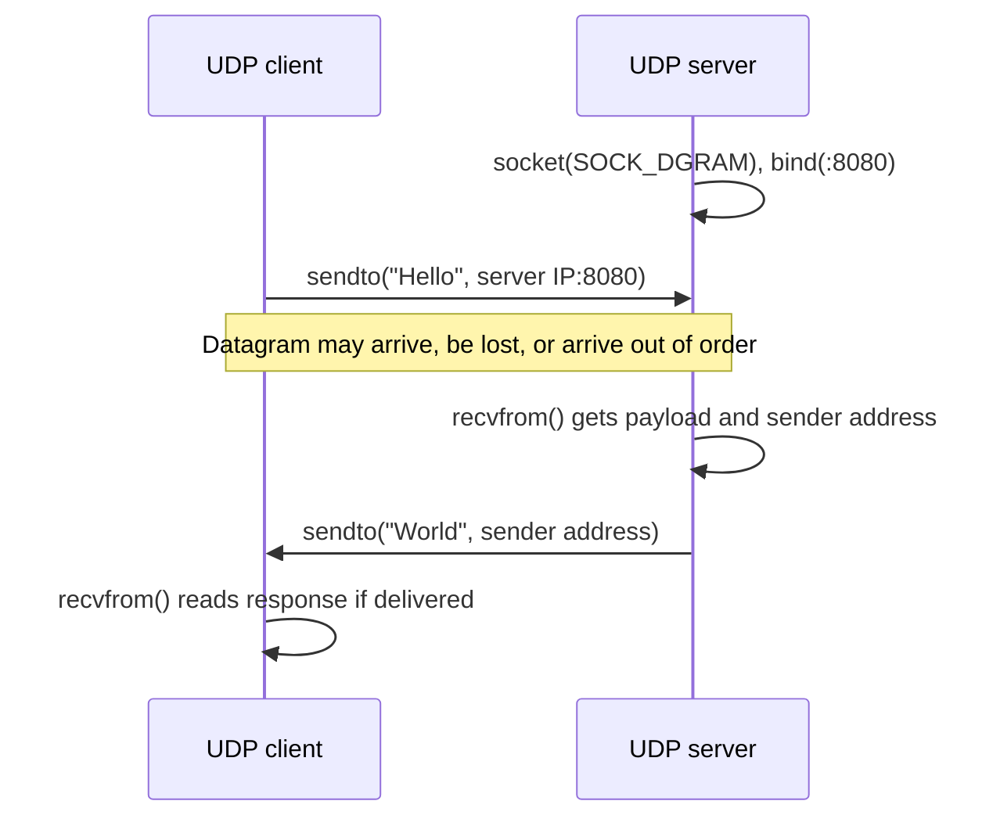

# IP, Ports, TCP/UDP and C++ `send()` / `recv()` — Interview Study Guide

## 1. Big picture

Two processes on different machines communicate through **sockets**. An IP address identifies a network interface (and enables routing to a host), a **port** identifies a transport endpoint on that host, and **TCP or UDP** specifies transport behavior. The OS kernel demultiplexes incoming traffic to the appropriate socket; the process reads data from that socket.

Example:

| | Client (Machine A) | Server (Machine B) |
|---|---|---|
| IP | `192.168.1.10` | `192.168.1.20` |
| Port | `52000` (example ephemeral port) | `8080` (listening port) |
| Role | Initiates connection, sends `Hello` | Accepts connection, replies `World` |

The TCP connection is identified by the protocol and **4-tuple** `(source IP, source port, destination IP, destination port)`. A server can have many established connections sharing its listening port because their 4-tuples differ.

> **Important:** A port identifies a socket endpoint, not inherently a unique process. One process may own many sockets; sockets can be shared across processes under some designs.

## 2. End-to-end TCP sequence diagram



**Note:** The sequence is conceptual. The handshake's final ACK and data may overlap in time; `send()` success does not mean the peer's application has received the data. TCP can split or combine writes arbitrarily.

## 3. What do “Hello” and “World” mean?

They are arbitrary **application payloads**:

1. Client calls `send(fd, "Hello", 5, 0)` to enqueue five bytes into its TCP socket's send path.
2. TCP transports bytes to the remote TCP endpoint, retransmitting lost data as necessary while the connection remains healthy.
3. Server calls `recv(fd, buf, capacity, 0)` to read bytes from the connection.
4. Server processes the request and calls `send(fd, "World", 5, 0)`.
5. Client calls `recv()` to read the response.

Real applications send structured data instead: HTTP requests/responses, JSON, protobuf messages, custom binary frames, etc. For HTTPS, TLS encrypts application data above TCP.

## 4. Protocol stack and encapsulation



At the receiver, the network interface and kernel process link/IP/transport headers, verify and route data to the matching socket, and place payload bytes into the socket receive buffer. The server's `recv()` copies available bytes into user memory (in normal socket I/O). Ethernet MAC addresses are generally for the **next hop** on each link, not the final remote MAC across the internet.

## 5. Essential POSIX TCP socket APIs (Linux/macOS)

| API | Purpose | Key detail |
|---|---|---|
| `socket(AF_INET, SOCK_STREAM, 0)` | Create IPv4 TCP socket | Returns file descriptor or `-1` |
| `bind(fd, addr, len)` | Associate local IP/port | Servers usually bind fixed port; client often lets OS choose |
| `listen(fd, backlog)` | Make TCP socket passive | `backlog` controls pending connection queue behavior |
| `accept(listen_fd, ...)` | Obtain a **new connected socket** | Listening socket remains open for future clients |
| `connect(fd, addr, len)` | Initiate TCP connection | Usually triggers handshake; OS normally chooses ephemeral source port |
| `send(fd, data, len, flags)` | Write bytes to connected socket | Can return fewer bytes than requested |
| `recv(fd, buf, len, flags)` | Read bytes from connected socket | Can return any positive number up to `len` |
| `shutdown(fd, SHUT_WR)` | Half-close local write direction | Peer sees EOF after queued bytes arrive |
| `close(fd)` | Release socket descriptor | TCP shutdown follows socket lifetime/linger rules |
| `setsockopt()` | Configure socket options | Examples: `SO_REUSEADDR`, `SO_KEEPALIVE` |
| `getsockname()` / `getpeername()` | Inspect local/peer address | Useful for debugging actual ephemeral port |

For Windows use Winsock: `WSAStartup()`, `SOCKET`, `closesocket()`, `WSAGetLastError()`. The examples below use POSIX APIs.

## 6. `send()` in detail

```cpp
#include <sys/socket.h>
ssize_t send(int sockfd, const void* buf, size_t len, int flags);
```

- `sockfd`: connected socket descriptor.
- `buf`: pointer to bytes to send.
- `len`: number of bytes requested.
- `flags`: normally `0`; Linux supports `MSG_NOSIGNAL` to avoid `SIGPIPE` on a broken connection.
- Return `> 0`: number of bytes **accepted by the local socket send path**, not necessarily delivered to the peer.
- Return `-1`: error; inspect `errno` (`EINTR`, `EAGAIN`/`EWOULDBLOCK`, `EPIPE`, `ECONNRESET`, etc.).
- A successful call can be **partial**: `send(fd, buf, 65536, 0)` might return `20000`.

**Correct TCP sending loop (blocking socket):**

```cpp
#include <cerrno>
#include <cstddef>
#include <sys/socket.h>

bool sendAll(int fd, const void* data, size_t length) {
    const char* p = static_cast<const char*>(data);
    size_t sent = 0;
    while (sent < length) {
        ssize_t n = send(fd, p + sent, length - sent, MSG_NOSIGNAL); // Linux
        if (n > 0) { sent += static_cast<size_t>(n); continue; }
        if (n < 0 && errno == EINTR) continue;
        return false; // includes nonblocking EAGAIN; needs readiness handling there
    }
    return true;
}
```

`MSG_NOSIGNAL` is Linux-specific; on macOS use the supported `SO_NOSIGPIPE` option or handle `SIGPIPE`. For a nonblocking socket, do **not** treat `EAGAIN` as a permanent failure: wait for writable readiness using `poll`/`epoll`/`kqueue` and resume at the unsent offset. Sending a zero-length buffer is not a useful data-progress operation.

## 7. `recv()` in detail

```cpp
#include <sys/socket.h>
ssize_t recv(int sockfd, void* buf, size_t len, int flags);
```

- `sockfd`: connected socket descriptor.
- `buf`: writable destination buffer.
- `len`: maximum bytes to copy.
- `flags`: usually `0`; `MSG_PEEK` inspects without consuming.
- Return `> 0`: that many bytes read; **not guaranteed to equal the size of a peer's `send()`**.
- Return `0` (for a positive-length TCP read): peer has performed an orderly write-side shutdown and all preceding bytes were consumed (EOF).
- Return `-1`: error; `errno` may be `EINTR`, `EAGAIN`, `ECONNRESET`, etc.

TCP is a **byte stream**, not a message protocol. If the sender executes `send("Hello",5)` and `send("World",5)`, receiver calls might read `"Hel"`, then `"loWorld"`; or all ten bytes together. Applications must define framing, e.g. fixed-size records, delimiter, or a length-prefixed message.

**Read exactly N bytes (blocking socket):**

```cpp
#include <cerrno>
#include <cstddef>
#include <sys/socket.h>

bool recvExact(int fd, void* data, size_t length) {
    char* p = static_cast<char*>(data);
    size_t received = 0;
    while (received < length) {
        ssize_t n = recv(fd, p + received, length - received, 0);
        if (n > 0) { received += static_cast<size_t>(n); continue; }
        if (n == 0) return false; // EOF before full message
        if (errno == EINTR) continue;
        return false; // nonblocking EAGAIN needs readiness handling
    }
    return true;
}
```

**String caution:** `recv()` does not add `\0`; construct `std::string(buf, n)` for `n > 0`, or explicitly add a terminator when space permits.

## 8. Complete runnable C++11 TCP server and client

These examples use **fixed 5-byte request and response messages** for clarity. They handle partial sends/receives and interrupted system calls. They are deliberately single-client and blocking, not a production server.

### `server.cpp`

```cpp
#include <arpa/inet.h>
#include <cerrno>
#include <cstring>
#include <iostream>
#include <sys/socket.h>
#include <unistd.h>

bool sendAll(int fd, const char* p, size_t len) {
    size_t done = 0;
    while (done < len) {
        ssize_t n = send(fd, p + done, len - done, MSG_NOSIGNAL);
        if (n > 0) done += static_cast<size_t>(n);
        else if (n < 0 && errno == EINTR) continue;
        else return false;
    }
    return true;
}

bool recvExact(int fd, char* p, size_t len) {
    size_t done = 0;
    while (done < len) {
        ssize_t n = recv(fd, p + done, len - done, 0);
        if (n > 0) done += static_cast<size_t>(n);
        else if (n < 0 && errno == EINTR) continue;
        else return false;
    }
    return true;
}

int main() {
    int listener = socket(AF_INET, SOCK_STREAM, 0);
    if (listener < 0) { perror("socket"); return 1; }

    int reuse = 1;
    setsockopt(listener, SOL_SOCKET, SO_REUSEADDR, &reuse, sizeof(reuse));

    sockaddr_in address{};
    address.sin_family = AF_INET;
    address.sin_port = htons(8080);
    address.sin_addr.s_addr = htonl(INADDR_ANY); // all IPv4 interfaces

    if (bind(listener, reinterpret_cast<sockaddr*>(&address), sizeof(address)) < 0) {
        perror("bind"); close(listener); return 1;
    }
    if (listen(listener, 16) < 0) {
        perror("listen"); close(listener); return 1;
    }
    std::cout << "Listening on TCP port 8080...\n";

    int client = accept(listener, nullptr, nullptr);
    if (client < 0) { perror("accept"); close(listener); return 1; }

    char message[5];
    bool ok = recvExact(client, message, sizeof(message));
    if (ok) {
        std::cout << "Received: " << std::string(message, sizeof(message)) << '\n';
        ok = sendAll(client, "World", 5);
    }
    if (!ok) std::cerr << "I/O failed or peer disconnected\n";
    close(client);
    close(listener);
    return ok ? 0 : 1;
}
```

### `client.cpp`

```cpp
#include <arpa/inet.h>
#include <cerrno>
#include <iostream>
#include <string>
#include <sys/socket.h>
#include <unistd.h>

bool sendAll(int fd, const char* p, size_t len) {
    size_t done = 0;
    while (done < len) {
        ssize_t n = send(fd, p + done, len - done, MSG_NOSIGNAL);
        if (n > 0) done += static_cast<size_t>(n);
        else if (n < 0 && errno == EINTR) continue;
        else return false;
    }
    return true;
}

bool recvExact(int fd, char* p, size_t len) {
    size_t done = 0;
    while (done < len) {
        ssize_t n = recv(fd, p + done, len - done, 0);
        if (n > 0) done += static_cast<size_t>(n);
        else if (n < 0 && errno == EINTR) continue;
        else return false;
    }
    return true;
}

int main(int argc, char* argv[]) {
    const char* ip = argc > 1 ? argv[1] : "127.0.0.1";
    int fd = socket(AF_INET, SOCK_STREAM, 0);
    if (fd < 0) { perror("socket"); return 1; }

    sockaddr_in server{};
    server.sin_family = AF_INET;
    server.sin_port = htons(8080);
    if (inet_pton(AF_INET, ip, &server.sin_addr) != 1) {
        std::cerr << "Invalid IPv4 address\n"; close(fd); return 1;
    }
    if (connect(fd, reinterpret_cast<sockaddr*>(&server), sizeof(server)) < 0) {
        perror("connect"); close(fd); return 1;
    }

    char reply[5];
    bool ok = sendAll(fd, "Hello", 5) && recvExact(fd, reply, sizeof(reply));
    if (ok) std::cout << "Received: " << std::string(reply, sizeof(reply)) << '\n';
    else std::cerr << "I/O failed or peer disconnected\n";
    close(fd);
    return ok ? 0 : 1;
}
```

### Build and run

```bash
g++ -std=c++11 -Wall -Wextra -O2 server.cpp -o server
g++ -std=c++11 -Wall -Wextra -O2 client.cpp -o client
```

Terminal 1:

```bash
./server
# Listening on TCP port 8080...
# Received: Hello
```

Terminal 2:

```bash
./client 127.0.0.1
# Received: World
```

For two actual machines, run the server on Machine B and invoke `./client 192.168.1.20` from Machine A, replacing the address with Machine B's reachable IP. Permit inbound TCP 8080 through the firewall. `INADDR_ANY` listens on all local IPv4 interfaces; for a restricted service, bind to a specific interface/address.

**Why no explicit client `bind()`?** `connect()` normally causes the OS to assign a local source IP and ephemeral port. `52000` was only an illustrative example, not guaranteed.

## 9. How TCP and UDP differ

| Property | TCP | UDP |
|---|---|---|
| Setup | 3-way handshake | No transport connection handshake |
| Delivery | Reliable ordered **byte stream** while connection functions | Best-effort **datagrams**; no delivery/order guarantee |
| Boundaries | No message boundaries | Preserves datagram boundaries |
| Retransmission | TCP retransmits lost segments | Application protocol handles recovery if desired |
| Flow/congestion control | Built in | Not built into UDP |
| Typical use | HTTP/1.1, HTTP/2, SSH, database connections | DNS (often), voice/video, gaming; QUIC/HTTP/3 uses UDP |
| API | `SOCK_STREAM`, `connect`, `send`, `recv` | `SOCK_DGRAM`, `sendto`, `recvfrom` (or `connect` + `send`/`recv`) |

**UDP sequence:**



Minimal UDP calls:

```cpp
// Client, after creating a SOCK_DGRAM socket and filling server sockaddr_in:
sendto(fd, "Hello", 5, 0,
       reinterpret_cast<sockaddr*>(&server), sizeof(server));

// Server, after creating and binding a SOCK_DGRAM socket:
char buf[1024];
sockaddr_in peer{};
socklen_t peerLen = sizeof(peer);
ssize_t n = recvfrom(fd, buf, sizeof(buf), 0,
                     reinterpret_cast<sockaddr*>(&peer), &peerLen);
if (n > 0) {
    sendto(fd, "World", 5, 0,
           reinterpret_cast<sockaddr*>(&peer), peerLen);
}
```

For UDP, a receive buffer smaller than the datagram may cause truncation; unlike TCP, reading the remainder later generally is not possible. Always check `sendto`/`recvfrom` results in real code.

## 10. What happens in the kernel?

1. `send()` enters the kernel through a system call and copies or otherwise queues user bytes for TCP transmission.
2. TCP manages send buffers, sequence numbers, flow/congestion control, and retransmission.
3. IP routes packets toward the destination, potentially via the default gateway; ARP resolves the next-hop IPv4 MAC on an Ethernet LAN (IPv6 uses Neighbor Discovery).
4. Network interface transmits link-layer frames.
5. Remote NIC/kernel processes frames and IP packets; TCP validates and reorders segments and places in-order bytes into the receiving socket buffer.
6. `recv()` returns available bytes to the application, or blocks until bytes, EOF, error, or another wakeup condition.
7. TCP acknowledgments indicate transport-level receipt, **not** successful processing or persistence by the remote application. Use application-level acknowledgments if needed.

## 11. Blocking, nonblocking, timeouts and scalable I/O

- **Blocking `recv()`** waits when no data is available; **blocking `send()`** may wait for send-buffer space.
- **Nonblocking sockets** return `EAGAIN`/`EWOULDBLOCK` rather than wait when an operation would block.
- `poll()`/`select()`/Linux `epoll()` signal readiness; readiness is not a promise that arbitrary-size I/O will complete.
- Use timeouts/deadlines to avoid waiting forever; handle `EINTR`, partial I/O, and disconnections.
- One thread per connection can work for modest workloads; event loops with `epoll` are common for high concurrency on Linux; Windows uses IOCP.
- `TCP_NODELAY` changes Nagle behavior; `SO_KEEPALIVE` probes long-idle connections but is not a substitute for application deadlines.
- `SO_REUSEADDR` assists restart/bind semantics; it does **not** make arbitrary concurrent binds safe.

## 12. Practical packet and socket debugging on Linux

```bash
ss -lntp                   # listening TCP sockets and owning processes
ss -tnp                    # established TCP sockets
ss -lunp                   # listening/unconnected UDP sockets
sudo lsof -nP -iTCP:8080   # process using TCP port 8080
ip addr                    # local interfaces and addresses
ip route                    # routes and default gateway
ip neigh                    # ARP/neighbor cache
ping 192.168.1.20          # ICMP reachability (may be filtered)
nc -vz 192.168.1.20 8080  # TCP connection check
sudo tcpdump -ni any tcp port 8080  # observe handshake and traffic
```

To observe the handshake, start `tcpdump` before running the client. For local loopback traffic use `-i lo` if available. `strace -e trace=network ./client 127.0.0.1` can show socket-related system calls on Linux.

## 13. Common Principal Engineer interview follow-ups

**Q1. If `send(fd, data, 64*1024, 0)` returns `20000`, is that an error?**  
No. It means 20,000 bytes were accepted locally. Advance the pointer by 20,000 and retry the remaining 45,536 bytes (with readiness handling for nonblocking I/O).

**Q2. If `send()` returns the full count, has the server received it?**  
No. It only confirms local acceptance. TCP ACKs confirm receipt by peer TCP, not application processing.

**Q3. If server calls `recv(buf, 1024)`, will it wait for 1024 bytes?**  
Normally no. Blocking `recv()` can return as soon as some bytes are available. Use a loop for an exact length or a framing protocol.

**Q4. What does `recv()` returning zero mean?**  
For a positive-length TCP receive, orderly peer write-side shutdown and no more bytes remaining to read. It is not the same as a connection reset.

**Q5. Can multiple clients use server port 8080?**  
Yes. `accept()` returns a separate connected socket for each TCP connection, distinguished by the connection 4-tuple.

**Q6. Why is the client source port usually ephemeral?**  
The OS selects an available local port so the client can have concurrent transport endpoints without requiring a hardcoded port.

**Q7. Does TCP preserve `send()` boundaries?**  
No. It preserves byte order, not application messages. Add framing.

**Q8. How does UDP `recvfrom()` differ from TCP `recv()`?**  
`recvfrom()` can provide the sender address for each UDP datagram; TCP `recv()` reads a connected byte stream. UDP preserves datagram boundaries.

**Q9. Why does the server call both `listen()` and `accept()`?**  
`listen()` makes a socket passive; `accept()` retrieves an incoming connection as a new socket, leaving the listening socket available.

**Q10. How would you build reliable application semantics?**  
Use explicit message framing, request IDs, deadlines, retries with idempotency, application acknowledgments, and durable storage when required. TCP reliability alone cannot guarantee exactly-once business processing.

## 14. One-minute interview answer

> Two processes communicate using sockets. The destination IP allows the network to route traffic to the destination host, and the destination transport port helps its OS deliver data to the appropriate socket. For TCP, the server creates a socket, binds and listens; the client calls `connect()` and completes the three-way handshake. The client calls `send()` to write application bytes such as `Hello`; TCP/IP carries those bytes over the network, and the server reads them with `recv()`. The server can send a response such as `World` on the connected socket. TCP provides an ordered reliable byte stream, but `send()` may be partial and `recv()` does not preserve message boundaries. UDP instead sends individual datagrams without a transport handshake or delivery guarantee.

## 15. Important accuracy notes

- IP addresses are **logical network-layer addresses**, not permanent physical machine identifiers.
- A port number ranges from **0 to 65535**; usable listening/client port choices depend on OS rules. IANA dynamic/private range is **49152–65535**, but OS ephemeral ranges vary; not every port above 1023 is ephemeral.
- Port 443 may carry HTTPS over **TCP** (HTTP/1.1 or HTTP/2) or **UDP** (QUIC/HTTP/3).
- `send()` and `recv()` are not guaranteed to transfer the full requested byte count in one call.
- TCP delivery guarantees are conditional on a functioning connection; it cannot guarantee application processing or survival of crashes.
- The server's `accept()` returns a **connected descriptor different from the listening descriptor**.
- A TCP socket can be half-closed; one direction can finish while the other continues.
