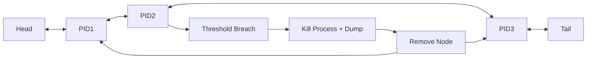

# Stability-Monitor Daemon in TV Systems

The `stability-monitor` daemon runs consistently in TV systems, monitoring memory usage, CPU usage, and flash usage. It includes three distinct threads:

- `MemoryMonitor`
- `FlashMonitor`
- `CPUMonitor`

---

## Overall Architecture

```mermaid
flowchart TD
    A[Start stability-monitor daemon] --> B[Initialize Threads]

    B --> T1[MemoryMonitor Thread]
    B --> T2[FlashMonitor Thread]
    B --> T3[CPUMonitor Thread]

    T3 --> L1[Read /proc via driver]
    T1 --> L1

    L1 --> L2[Update Doubly Linked List (Process Nodes)]

    L2 --> L3[Each Node: PID + CPU stats + Memory stats]

    T3 --> C1[Traverse Linked List]
    C1 --> C2[Compute CPU usage (1 min & 3 min)]

    C2 --> C3{CPU Threshold Breach?}

    C3 -->|>=95% for 1 min| C4[Trigger Alarm]
    C3 -->|>=90% for 3 min| C4

    C4 --> C5[Send SIGABRT (Signal 6)]
    C5 --> C6[Generate Core Dump]

    C6 --> C7[Remove Node from Linked List]
    C7 --> C8[Adjust Pointers]

    T1 --> M1[Traverse Linked List]
    M1 --> M2[Check Current Memory Usage]
    M2 --> M3{Memory Threshold Breach?}

    M3 -->|Yes| M4[Trigger Memory Alarm]

    C7 --> R1[Process Restarts]
    R1 --> R2[Read /proc again]
    R2 --> R3[Create New Node]
    R3 --> R4[Insert into List]

    C8 --> L1
    M4 --> L1
    R4 --> L1
```

---

## Doubly Linked List Mechanism

The system maintains a **single shared doubly linked list** which acts as the central data structure for both CPU and memory monitoring.

### Key Characteristics
- Each node represents a process
- Contains:
  - PID
  - CPU stats (historical)
  - Memory stats (current)
- Shared across threads (CPU + Memory)



### Lifecycle of a Process Node
1. Process detected → Node created
2. Node added to linked list
3. CPU & Memory monitored continuously
4. Threshold breach → Process killed
5. Node removed (O(1) operation)
6. Process restarts → New node inserted

---

## Threads Overview

### 1. CPUMonitor

`CPUMonitor` checks CPU usage of all processes. The system has **4 CPU cores (400% total capacity)**.

#### Threshold Rules
- **>=95% CPU for 1 minute** → Kill process
- **>=90% CPU for 3 minutes** → Kill process

#### Actions on Violation
- Trigger alarm
- Send `SIGABRT (signal 6)`
- Generate core dump
- Remove process node from linked list

#### CPU Calculation

**Inputs:**
- `/proc/uptime`
- `/proc/[PID]/stat`
- Hertz (`CLK_TCK`)

**Formula:**
```
total_time = utime + stime
(total_time += cutime + cstime optional)

seconds = uptime - (starttime / Hertz)

cpu_usage = 100 * ((total_time / Hertz) / seconds)
```

#### Implementation Logic
- Reads `/proc` periodically
- Maintains last **1 min & 3 min history** per process
- Applies sliding window logic

---

### 2. MemMonitor

`MemMonitor` tracks RAM usage in real-time.

#### Categories & Limits
- **Daemon (PPID=1)** → 40 MB
- **DefaultApp** → 110 MB
- **WebApp (WebRuntime)** → 600 MB

#### Behavior
- Checks **current usage only** (no history)
- If exceeded:
  - Kill process
  - Trigger alarm

---

### 3. FlashMonitoring

Tracks flash usage (mainly `/opt` partition).

#### Behavior
- Monitors total flash usage
- If threshold exceeded:
  - Identify **top 5 processes**
  - Store in SQLite DB
  - Trigger alarm
  - Reboot system

---

## Thread Synchronization

- All threads share the **same linked list**
- Requires:
  - Mutex / locks for safe updates
  - Consistent read/write control

---

## Key Design Insights

### Single Source of Truth
- One linked list shared across all monitors

### Efficient Deletion
- Doubly linked list → **O(1) removal** during process kill

### Mixed Monitoring Strategy
- CPU → historical (1 min, 3 min)
- Memory → real-time snapshot

### Process Recovery Handling
- Automatic re-insertion when process restarts

---

## Suggested Enhancements

- Add locking strategy (mutex / RW lock)
- Introduce cooldown to avoid repeated kills
- Maintain whitelist for critical processes
- Add ring buffer per node for CPU history

---

## Thread Synchronization and Logging

All three threads run concurrently with proper synchronization. Logs are stored in a shared logging system for debugging and observability.
