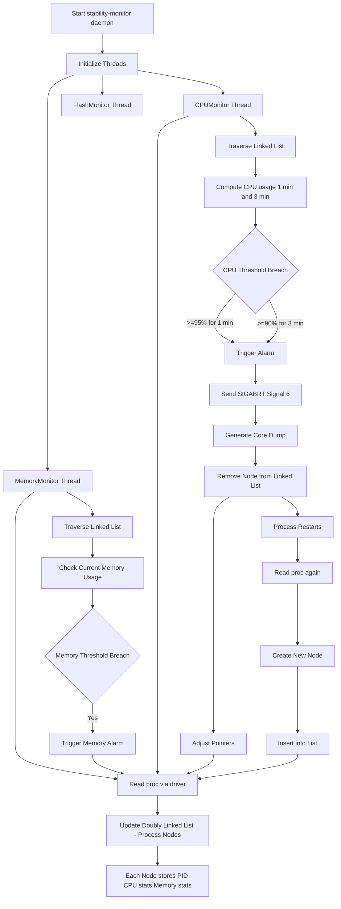

# Stability-Monitor Daemon in TV Systems

The `stability-monitor` daemon continuously runs in TV systems to monitor **CPU, Memory, and Flash usage** of all processes. It ensures system stability by detecting abnormal resource consumption and taking corrective actions.

---

## 🧠 Core Design

- Multi-threaded daemon
- Shared **Doubly Linked List** as central data structure
- Real-time + historical monitoring
- Automatic process recovery handling

---

## 🔷 Overall Architecture



---

## 🔷 Doubly Linked List Design

A **single shared doubly linked list** is used across all monitoring threads.

### Node Structure
Each node contains:
- Process ID (PID)
- CPU usage history (for 1 min & 3 min window)
- Memory usage (current snapshot)
- Pointers:
  - `prev`
  - `next`

### Why Doubly Linked List?
- **O(1) deletion** when process is killed
- Efficient traversal for monitoring
- Dynamic insertion when processes restart

---

## 🔷 Process Lifecycle Flow

1. Process detected via `/proc`
2. Node created and inserted into list
3. CPU & Memory continuously monitored
4. Threshold breach detected
5. Process killed using `SIGABRT (6)`
6. Core dump generated
7. Node removed from list
8. Process restarts
9. New node created and inserted

---

## 🔷 CPUMonitor (Detailed)

### System CPU Capacity
- 4 cores → Total = **400% CPU**

### Threshold Rules
- **>=95% CPU for 1 minute**
- **>=90% CPU for 3 minutes**

### Behavior
- Reads `/proc` periodically
- Maintains **historical CPU usage**
- Uses sliding window logic

### CPU Calculation

#### Required Inputs
- `/proc/uptime`
- `/proc/[PID]/stat`
- Hertz (CLK_TCK)

#### Formula
```
total_time = utime + stime
total_time += cutime + cstime (optional)

seconds = uptime - (starttime / Hertz)

cpu_usage = 100 * ((total_time / Hertz) / seconds)
```

### Action on Threshold Breach
- Raise alarm
- Send `SIGABRT`
- Generate core dump
- Remove node from linked list

---

## 🔷 MemMonitor (Detailed)

### Categories

| Type        | Condition       | Limit |
|------------|----------------|------|
| Daemon     | PPID = 1       | 40 MB |
| DefaultApp | Regular apps   | 110 MB |
| WebApp     | WebRuntime     | 600 MB |

### Behavior
- Checks **current memory usage only**
- No historical tracking
- Immediate action on breach

### Action
- Kill process
- Trigger memory alarm

---

## 🔷 FlashMonitor (Detailed)

### Scope
- Focus on `/opt` partition

### Behavior
- Monitor total flash usage
- Identify **top 5 consumers**

### Action
- Store top processes in SQLite DB
- Trigger alarm
- Reboot system

---

## 🔷 Thread Synchronization

Since all threads share the same linked list:

### Required Mechanisms
- Mutex / locks
- Safe insertion & deletion
- Concurrent traversal protection

---

## 🔷 Key Design Characteristics

### Single Source of Truth
- One shared linked list for all monitors

### Hybrid Monitoring
- CPU → Historical (stateful)
- Memory → Real-time (stateless)

### Fault Handling
- Automatic restart handling
- Core dump for debugging

---

## 🔷 Possible Enhancements

- Add Read-Write locks for better performance
- Introduce cooldown to prevent repeated kills
- Maintain whitelist for critical processes
- Use ring buffer for CPU history per node

---

## 🔷 Logging

- Centralized logging system
- Tracks:
  - Threshold breaches
  - Process kills
  - Resource usage trends
