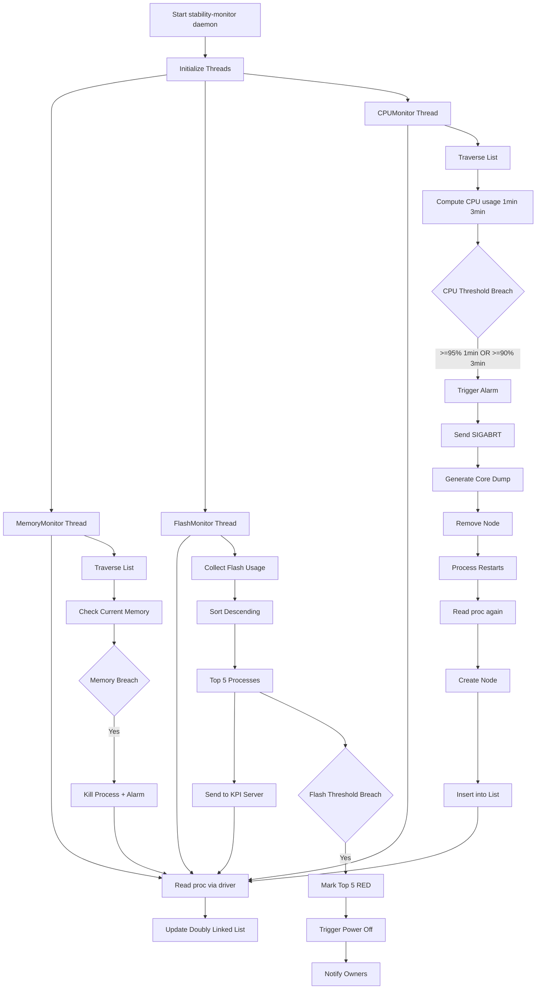

# Stability-Monitor Daemon in TV Systems

The `stability-monitor` daemon continuously runs in TV systems to monitor **CPU, Memory, and Flash usage** of all processes and ensure system stability.

---

## 🔷 Unified Architecture (All 3 Threads)



---

## 🔷 Doubly Linked List Design (Detailed)

A **single shared doubly linked list** is used across all monitoring threads and acts as the **central source of truth**.

### Node Structure

Each node represents a process and contains:

- **Process ID (PID)**
- **CPU usage history**
  - Maintains samples for:
    - Last 1 minute window
    - Last 3 minute window
- **Memory usage (current snapshot)**
- **Pointers**
  - `prev` → Previous node
  - `next` → Next node

### Internal Design Insight

- CPU history is typically stored as a **time-series buffer (ring buffer)** per node
- Each sample is timestamped to support sliding window calculations
- Memory is stored as **latest snapshot only**

---

### Why Doubly Linked List?

- ✅ **O(1) deletion** when a process is killed (no shifting like arrays)
- ✅ Efficient forward/backward traversal
- ✅ Supports dynamic insertion when processes restart
- ✅ Works well with continuous monitoring loops

---

## 🔷 Process Lifecycle Flow

1. Process detected via `/proc`
2. Node created and inserted into linked list
3. CPU & Memory continuously monitored
4. Threshold breach detected
5. Process killed using `SIGABRT (6)`
6. Core dump generated for debugging
7. Node removed from linked list (O(1))
8. Process restarts (by system/service manager)
9. New node created and inserted again

---

## 🔷 CPUMonitor (Detailed)

### System CPU Capacity
- 4 cores → Total = **400% CPU**

---

### Threshold Rules
- **>=95% CPU for 1 minute**
- **>=90% CPU for 3 minutes**

---

### Behavior

- Periodically reads `/proc`
- Tracks CPU usage per process
- Maintains **historical data**
- Applies **sliding window logic**

---

### CPU Calculation

#### Required Inputs
- `/proc/uptime`
- `/proc/[PID]/stat`
- Hertz (`CLK_TCK`)

#### Formula
```
total_time = utime + stime
total_time += cutime + cstime (optional)

seconds = uptime - (starttime / Hertz)

cpu_usage = 100 * ((total_time / Hertz) / seconds)
```

---

### Sliding Window Logic (Important)

- CPU samples collected periodically
- Stored in node buffer
- Compute:
  - Avg CPU over last 1 min
  - Avg CPU over last 3 min

---

### Action on Threshold Breach

- Raise alarm
- Send `SIGABRT`
- Generate core dump
- Remove node from linked list

---

## 🔷 MemMonitor (Detailed)

### Categories

| Type        | Condition       | Limit |
|------------|----------------|------|
| Daemon     | PPID = 1       | 40 MB |
| DefaultApp | Regular apps   | 110 MB |
| WebApp     | WebRuntime     | 600 MB |

---

### Behavior

- Reads memory usage from `/proc`
- Uses **current snapshot only**
- No historical tracking
- Faster detection compared to CPU

---

### Action

- Kill process immediately
- Trigger memory alarm

---

## 🔷 FlashMonitoring (Enhanced - Production Level)

### Scope

- Monitors flash usage across all processes
- Focus on critical partitions like `/opt`

---

### Core Logic

1. Collect flash usage of all running processes
2. Sort processes in **descending order**
3. Identify **top 5 flash consumers**

---

### KPI Integration (Very Important)

- Top 5 processes are continuously pushed to **Samsung KPI server**
- Acts as a **telemetry and observability system**

---

### Customer Issue Debug Flow

When a customer reports:

- TV stuck / hang
- Performance issue

👉 Engineers:

1. Fetch KPI logs
2. Check top 5 processes at that timestamp
3. Identify abnormal flash consumers

---

### Threshold-Based Protection

- Global flash usage threshold is defined
- If exceeded:

  - Trigger **power-off signal**
  - Mark **top 5 processes in RED** in KPI server

---

### Alerting Mechanism

If customer reports **abrupt power-off**:

- KPI already has **RED flagged processes**
- System:
  - Notifies process owners
  - Helps immediate root cause analysis

---

## 🔷 Thread Synchronization

Since all threads share the same linked list:

### Required Mechanisms

- Mutex locks (critical section protection)
- Safe insertion and deletion
- Prevent race conditions during traversal

---

## 🔷 Key Design Characteristics

### Single Source of Truth
- One shared linked list across all monitors

### Hybrid Monitoring Model
- CPU → Historical (stateful)
- Memory → Real-time (stateless)
- Flash → Aggregated + system-wide

### Fault Handling
- Automatic process restart handling
- Core dump enables debugging

---

## 🔷 Possible Enhancements (Architect Level)

- Use **Read-Write locks** instead of mutex
- Introduce **cooldown period** to avoid repeated kills
- Maintain **whitelist of critical processes**
- Use **ring buffer for CPU samples**
- Add **rate-limited alerting**

---

## 🔷 Logging & Observability

- Centralized logging system
- Tracks:
  - CPU spikes
  - Memory breaches
  - Flash anomalies
  - Process kills
- KPI server adds **production visibility**
