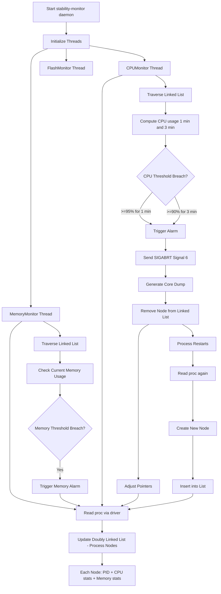

# Stability-Monitor Daemon in TV Systems

## Overall Architecture

```mermaid
flowchart TD
    A[Start stability-monitor daemon] --> B[Initialize Threads]

    B --> T1[MemoryMonitor Thread]
    B --> T2[FlashMonitor Thread]
    B --> T3[CPUMonitor Thread]

    T3 --> L1[Read proc via driver]
    T1 --> L1

    L1 --> L2[Update Doubly Linked List - Process Nodes]

    L2 --> L3[Each Node: PID + CPU stats + Memory stats]

    T3 --> C1[Traverse Linked List]
    C1 --> C2[Compute CPU usage 1 min and 3 min]

    C2 --> C3{CPU Threshold Breach?}

    C3 -->|>=95% for 1 min| C4[Trigger Alarm]
    C3 -->|>=90% for 3 min| C4

    C4 --> C5[Send SIGABRT Signal 6]
    C5 --> C6[Generate Core Dump]

    C6 --> C7[Remove Node from Linked List]
    C7 --> C8[Adjust Pointers]

    T1 --> M1[Traverse Linked List]
    M1 --> M2[Check Current Memory Usage]
    M2 --> M3{Memory Threshold Breach?}

    M3 -->|Yes| M4[Trigger Memory Alarm]

    C7 --> R1[Process Restarts]
    R1 --> R2[Read proc again]
    R2 --> R3[Create New Node]
    R3 --> R4[Insert into List]

    C8 --> L1
    M4 --> L1
    R4 --> L1
```
