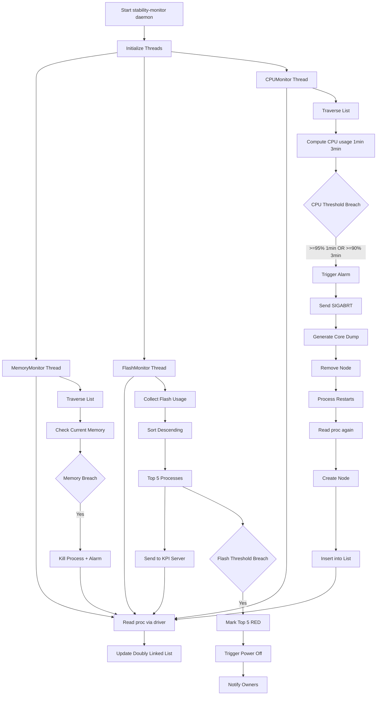

# Stability-Monitor Daemon in TV Systems

The `stability-monitor` daemon continuously runs in TV systems to monitor **CPU, Memory, and Flash usage** of all processes and ensure system stability.

---

## 🔷 Unified Architecture (All 3 Threads)

---

## 🔷 Core Design

- Multi-threaded daemon
- Single **shared doubly linked list**
- CPU = historical monitoring
- Memory = real-time monitoring
- Flash = system-wide analysis + KPI integration

---

## 🔷 Doubly Linked List

### Node Contains
- PID
- CPU stats (history for 1min & 3min)
- Memory stats
- prev / next pointers

### Benefits
- O(1) deletion
- Efficient traversal
- Dynamic updates

---

## 🔷 CPUMonitor

### Rules
- >=95% for 1 min
- >=90% for 3 min

### Action
- Kill process
- Core dump
- Remove node

---

## 🔷 MemMonitor

### Limits
- Daemon → 40 MB
- Default → 110 MB
- WebApp → 600 MB

### Action
- Kill process
- Raise alarm

---

## 🔷 FlashMonitor

### Flow
- Collect usage
- Sort descending
- Identify top 5

### KPI Integration
- Send top 5 to Samsung KPI server
- Helps debug TV stuck issues

### Threshold Case
- If exceeded:
  - Mark top 5 RED
  - Trigger power-off
  - Notify owners

---

## 🔷 Thread Synchronization

- Shared linked list across threads
- Requires:
  - Mutex locks
  - Safe insert/delete

---

## 🔷 Key Highlights

- Single source of truth
- Fast deletion (linked list)
- Real-time + historical monitoring
- Strong observability via KPI
