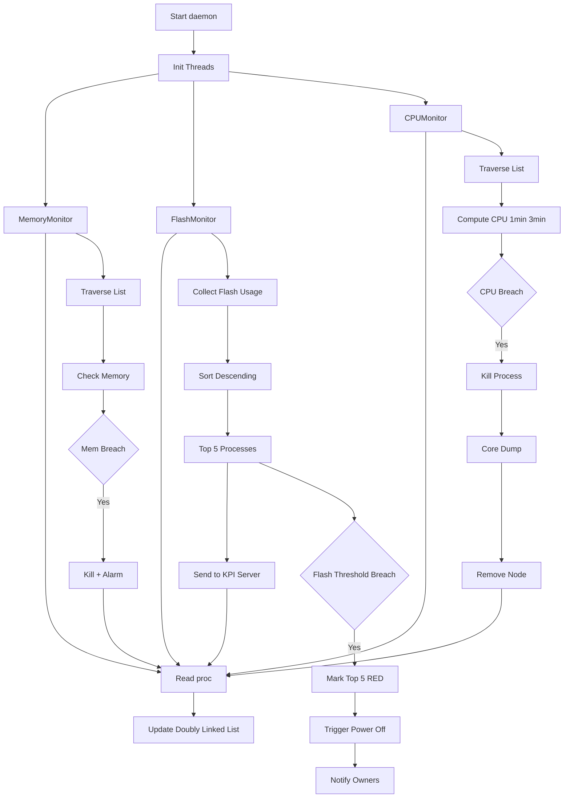

# Stability-Monitor Daemon in TV Systems

The `stability-monitor` daemon continuously runs in TV systems to monitor CPU, Memory, and Flash usage.

---

## 🔷 Overall Architecture (Updated with Flash Flow)

---

## 🔷 Flash Monitoring Explanation

- Collects flash usage of all processes
- Sorts them in descending order
- Top 5 processes sent to KPI server
- Helps debug customer issues (TV stuck)

### Threshold Case
- If flash exceeds limit:
  - Top 5 marked RED in KPI
  - Power-off triggered
  - Owners notified

---

(Rest of content remains same)
